# Project Map

## Purpose

Show the top-level repository structure and where key responsibilities live.

## Diagram

```mermaid
flowchart TD
  Root["AskMate repository"] --> Metadata["Plugin metadata and build config"]
  Root --> Source["src: product TypeScript"]
  Root --> Scripts["scripts: validation and vault install"]
  Root --> CI[".github: release and contribution workflow"]
  Root --> Docs["Public docs and policy"]
  Root --> DigVis["DigVis: visual documentation"]

  Source --> Plugin["src/plugin: central orchestrator"]
  Source --> UI["src/ui: sidebar, settings, modals"]
  Source --> Providers["src/providers: text and image API adapters"]
  Source --> Settings["src/settings: defaults, constants, normalizers"]
  Source --> Shared["src/shared: domain types and helpers"]
  Source --> Workflows["src/workflows: built-in prompt workflows"]

  Metadata --> Package["package.json scripts"]
  Metadata --> Manifest["manifest.json Obsidian metadata"]
  Metadata --> Build["esbuild.config.mjs bundle"]
  Scripts --> Smoke["roadmap-smoke-tests.ts"]
  CI --> Release["release.yml"]

  classDef core fill:#E0F2FE,stroke:#0284C7,color:#0F172A
  classDef config fill:#F1F5F9,stroke:#64748B,color:#0F172A
  classDef test fill:#DCFCE7,stroke:#16A34A,color:#14532D
  classDef external fill:#F3E8FF,stroke:#9333EA,color:#3B0764
  classDef docs fill:#FEF3C7,stroke:#D97706,color:#0F172A

  class Root,Source,Plugin,UI,Providers,Settings,Shared,Workflows core
  class Metadata,Package,Manifest,Build config
  class Scripts,Smoke,CI,Release test
  class Docs,DigVis docs
```

## Notes

The repository is a TypeScript Obsidian plugin. Runtime source is under `src/`, with `main.ts` exporting the plugin class from `src/plugin/AskMatePlugin.ts`. Build and release behavior is defined by `package.json`, `esbuild.config.mjs`, `manifest.json`, and `.github/workflows/release.yml`.

## Responsibility table

| Area | Responsibility | Primary files |
| --- | --- | --- |
| Plugin entry | Obsidian loads the plugin bundle through `main.js`, sourced from `main.ts`. | `main.ts`, `manifest.json`, `esbuild.config.mjs` |
| Orchestration | Lifecycle, settings, context capture, requests, providers, Apply, vault writes. | `src/plugin/AskMatePlugin.ts` |
| Sidebar runtime | Composer, request preview, active run state, messages, evidence chips, actions. | `src/ui/sidebar/AskMateView.ts`, `styles.css` |
| Settings UI | Provider setup, privacy defaults, workflows, review queue, batch, usage. | `src/ui/settings/AskMateSettingTab.ts` |
| Provider adapters | OpenAI, Azure, OpenRouter, Anthropic, Gemini, local OpenAI-compatible text paths. | `src/providers/*` |
| Domain model | Settings, request metadata, context attachments, queue, usage, workflows. | `src/shared/types.ts`, `src/settings/*` |
| Validation | Smoke assertions, TypeScript build, release checks. | `scripts/roadmap-smoke-tests.ts`, `package.json`, `.github/workflows/release.yml` |

## Traceability

| Field | Details |
| --- | --- |
| Source files inspected | File tree, `main.ts`, `package.json`, `manifest.json`, `esbuild.config.mjs`, `.github/workflows/release.yml`, `scripts/roadmap-smoke-tests.ts`, `src/*` |
| Key symbols | `AskMatePlugin`, `AskMateView`, `AskMateSettingTab`, `ProviderRuntime`, `WORKFLOWS` |
| Inferences | Runtime scope is inferred from `main.ts`, `esbuild.config.mjs`, and `tsconfig.json`. |
| Confidence | confirmed |
| Open questions | None for top-level structure. |
