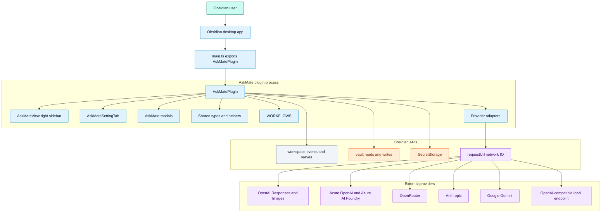

# Architecture Overview

## Purpose

Explain the major runtime components, ownership boundaries, and external systems.

## Diagram

## Notes

AskMate is loaded by Obsidian through `main.ts`, which exports `AskMatePlugin`. The plugin registers the right sidebar view, commands, workspace event listeners, ribbon icon, and settings tab. `AskMatePlugin` is the main orchestration point: it captures note context, normalizes settings, builds requests, routes provider calls, records usage, creates result notes and images, applies text back into notes, and manages review queues.

Provider adapters do not call browser `fetch` directly. They receive a `ProviderRuntime`, and the plugin implements `requestJson()` through Obsidian `requestUrl`.

## Runtime boundaries

| Boundary | Owner | Evidence |
| --- | --- | --- |
| Plugin lifecycle | `AskMatePlugin.onload()` | `src/plugin/AskMatePlugin.ts` |
| Sidebar UI | `AskMateView` | `src/ui/sidebar/AskMateView.ts` |
| Settings UI | `AskMateSettingTab` | `src/ui/settings/AskMateSettingTab.ts` |
| Provider dispatch | `completeProviderTextRequest()` | `src/providers/index.ts` |
| Provider IO | `ProviderRuntime.requestJson()` and `AskMatePlugin.requestJson()` | `src/providers/types.ts`, `src/plugin/AskMatePlugin.ts` |
| Secrets | `app.secretStorage.getSecret()` | `src/plugin/AskMatePlugin.ts` |
| Vault mutation | `vault.create`, `vault.createBinary`, `vault.modify` | `src/plugin/AskMatePlugin.ts` |

## Traceability

| Field | Details |
| --- | --- |
| Source files inspected | `main.ts`, `manifest.json`, `src/plugin/AskMatePlugin.ts`, `src/ui/sidebar/AskMateView.ts`, `src/ui/settings/AskMateSettingTab.ts`, `src/ui/modals/modals.ts`, `src/providers/index.ts`, `src/providers/types.ts`, `src/shared/types.ts` |
| Key symbols | `onload`, `registerView`, `addCommand`, `AskMateView`, `AskMateSettingTab`, `ProviderRuntime`, `requestJson`, `completeProviderTextRequest` |
| Inferences | The diagram groups Obsidian APIs as a boundary even though they are imported individually across files. |
| Confidence | confirmed |
| Open questions | None. |
