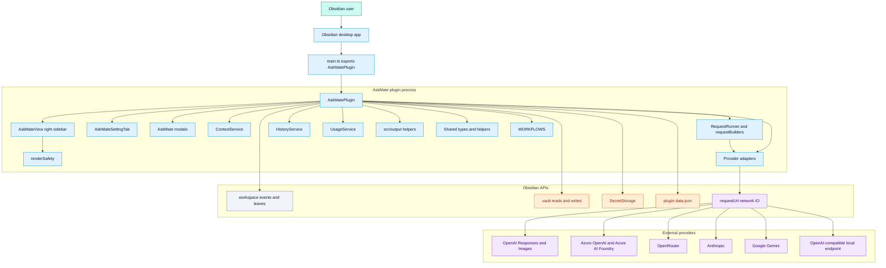

# Architecture Overview

## Purpose

Explain the major runtime components, ownership boundaries, and external systems.

## Diagram

```mermaid
flowchart TD
  User["Obsidian user"] --> Obsidian["Obsidian desktop app"]
  Obsidian --> Entry["main.ts exports AskMatePlugin"]
  Entry --> Plugin["AskMatePlugin"]

  subgraph "AskMate plugin process"
    Plugin --> Sidebar["AskMateView right sidebar"]
    Plugin --> SettingsUI["AskMateSettingTab"]
    Plugin --> Modals["AskMate modals"]
    Plugin --> ContextSvc["ContextService"]
    Plugin --> Runner["RequestRunner and requestBuilders"]
    Plugin --> HistorySvc["HistoryService"]
    Plugin --> UsageSvc["UsageService"]
    Plugin --> OutputHelpers["src/output helpers"]
    Sidebar --> RenderSafety["renderSafety"]
    Runner --> Providers
    Plugin --> Shared["Shared types and helpers"]
    Plugin --> WorkflowCatalog["WORKFLOWS"]
    Plugin --> Providers["Provider adapters"]
  end

  subgraph "Obsidian APIs"
    Workspace["workspace events and leaves"]
    Vault["vault reads and writes"]
    Secrets["SecretStorage"]
    PluginData["plugin data.json"]
    RequestUrl["requestUrl network IO"]
  end

  subgraph "External providers"
    OpenAI["OpenAI Responses and Images"]
    Azure["Azure OpenAI and Azure AI Foundry"]
    Router["OpenRouter"]
    Anthropic["Anthropic"]
    Gemini["Google Gemini"]
    Local["OpenAI-compatible local endpoint"]
  end

  Plugin --> Workspace
  Plugin --> Vault
  Plugin --> Secrets
  Plugin --> PluginData
  Providers --> RequestUrl
  RequestUrl --> OpenAI
  RequestUrl --> Azure
  RequestUrl --> Router
  RequestUrl --> Anthropic
  RequestUrl --> Gemini
  RequestUrl --> Local

  classDef user fill:#CCFBF1,stroke:#0F766E,color:#0F172A
  classDef core fill:#E0F2FE,stroke:#0284C7,color:#0F172A
  classDef config fill:#F1F5F9,stroke:#64748B,color:#0F172A
  classDef store fill:#FFEDD5,stroke:#EA580C,color:#7C2D12
  classDef external fill:#F3E8FF,stroke:#9333EA,color:#3B0764

  class User user
  class Obsidian,Entry,Plugin,Sidebar,SettingsUI,Modals,ContextSvc,Runner,HistorySvc,UsageSvc,OutputHelpers,RenderSafety,Shared,WorkflowCatalog,Providers core
  class Workspace config
  class Vault,Secrets,PluginData store
  class RequestUrl,OpenAI,Azure,Router,Anthropic,Gemini,Local external
```

## Notes

AskMate is loaded by Obsidian through `main.ts`, which exports `AskMatePlugin`. The plugin registers the right sidebar view, commands, workspace event listeners, ribbon icon, and settings tab. `AskMatePlugin` is the main orchestration point, but since the service extraction it delegates most work: `ContextService` captures note context and builds attachments, `RequestRunner` (with the pure `requestBuilders` and `promptSafety` modules) builds requests and calls providers, `HistoryService` owns note history and the review queue, and `UsageService` records usage and evaluates budgets. The plugin keeps settings load and save (`syncObjectInPlace` keeps the live settings object stable), commands, vault rename and delete events, result notes and images, Apply, and batch runs. `AskMateView` renders model replies through `renderSafety` before handing them to Obsidian's Markdown renderer.

Provider adapters do not call browser `fetch` directly. They receive a `ProviderRuntime`, and the plugin implements `requestJson()` through Obsidian `requestUrl`.

## Runtime boundaries

| Boundary | Owner | Evidence |
| --- | --- | --- |
| Plugin lifecycle | `AskMatePlugin.onload()` | `src/plugin/AskMatePlugin.ts` |
| Sidebar UI | `AskMateView` | `src/ui/sidebar/AskMateView.ts` |
| Settings UI | `AskMateSettingTab` | `src/ui/settings/AskMateSettingTab.ts` |
| Context capture | `ContextService` | `src/context/ContextService.ts` |
| Request building and provider calls | `RequestRunner`, `buildPrompt()`, `escapePromptDelimiters()` | `src/requests/RequestRunner.ts`, `src/requests/requestBuilders.ts`, `src/requests/promptSafety.ts` |
| Provider dispatch | `completeProviderTextRequest()` (OpenAI text uses `requestOpenAIResponses()` instead) | `src/providers/index.ts`, `src/providers/open-ai.ts` |
| Provider IO | `ProviderRuntime.requestJson()` and `AskMatePlugin.requestJson()` | `src/providers/types.ts`, `src/plugin/AskMatePlugin.ts` |
| Secrets | `app.secretStorage.getSecret()` | `src/plugin/AskMatePlugin.ts` |
| Vault mutation | `vault.create`, `vault.createBinary`, `vault.process`, and editor `replaceRange` or `replaceSelection` for open notes | `src/plugin/AskMatePlugin.ts` |
| Plugin data | `loadData()` and `saveData()` (through `saveSettings()`) for settings, note history, review queue and usage | `src/plugin/AskMatePlugin.ts`, `src/history/HistoryService.ts`, `src/usage/UsageService.ts` |
| Reply rendering | `renderSafety` helpers before `MarkdownRenderer` | `src/ui/sidebar/AskMateView.ts`, `src/ui/sidebar/renderSafety.ts` |

## Traceability

| Field | Details |
| --- | --- |
| Source files inspected | `main.ts`, `manifest.json`, `src/plugin/AskMatePlugin.ts`, `src/context/ContextService.ts`, `src/requests/RequestRunner.ts`, `src/requests/requestBuilders.ts`, `src/history/HistoryService.ts`, `src/usage/UsageService.ts`, `src/ui/sidebar/AskMateView.ts`, `src/ui/sidebar/renderSafety.ts`, `src/ui/settings/AskMateSettingTab.ts`, `src/ui/modals/modals.ts`, `src/providers/index.ts`, `src/providers/types.ts`, `src/shared/types.ts` |
| Key symbols | `onload`, `registerView`, `addCommand`, `ContextService`, `RequestRunner`, `HistoryService`, `UsageService`, `AskMateView`, `AskMateSettingTab`, `ProviderRuntime`, `requestJson`, `completeProviderTextRequest` |
| Inferences | The diagram groups Obsidian APIs as a boundary even though they are imported individually across files. |
| Confidence | confirmed |
| Open questions | None. |
