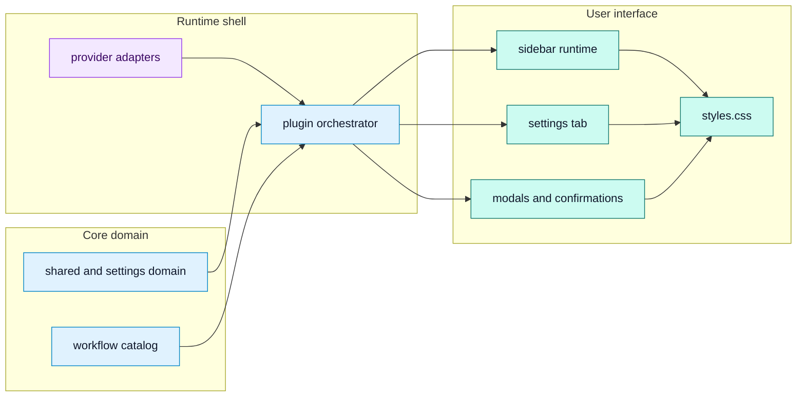

# Module Breakdown

## Purpose

Break the codebase into modules, responsibilities, likely ownership, and important files.

## Diagram

## Module responsibility table

| Module | Main responsibility | Important files | Inferred likely owner |
| --- | --- | --- | --- |
| Plugin core | Lifecycle, context capture, request building, provider routing, vault writes, Apply, queues, usage. | `src/plugin/AskMatePlugin.ts` | Core maintainer |
| Sidebar UI | Composer, workflow grid, request preview, active run state, rendering responses and image actions. | `src/ui/sidebar/AskMateView.ts`, `styles.css` | UI maintainer |
| Settings UI | Provider config, context controls, workflow automation, review queue, usage stats. | `src/ui/settings/AskMateSettingTab.ts` | Settings maintainer |
| Modals | Confirmations, diff preview, prompt inspector, text viewer, note history. | `src/ui/modals/modals.ts` | UI maintainer |
| Providers | Provider-specific endpoints, request bodies, response parsing, model refresh. | `src/providers/*` | Integration maintainer |
| Shared model | Type definitions for settings, requests, outputs, workflows, queues, usage. | `src/shared/types.ts`, `src/shared/core.ts` | Core maintainer |
| Settings domain | Defaults, constants, migration, normalization, validation helpers. | `src/settings/constants.ts`, `src/settings/defaults.ts`, `src/settings/normalize.ts` | Core maintainer |
| Workflows | Built-in workflow prompts and command IDs. | `src/workflows/builtInWorkflows.ts` | Prompt and product maintainer |
| Validation | Smoke tests, build, release checks. | `scripts/roadmap-smoke-tests.ts`, `package.json`, `.github/workflows/release.yml` | Release maintainer |

## Notes

The architecture is intentionally centralized around `AskMatePlugin`. This makes safety checks and Obsidian API access easy to audit, but it also creates a hotspot where unrelated features can interact. The shared model and settings normalizers are the best starting point when adding new persisted behavior because UI and plugin code both depend on them.

## Traceability

| Field | Details |
| --- | --- |
| Source files inspected | `src/plugin/AskMatePlugin.ts`, `src/ui/sidebar/AskMateView.ts`, `src/ui/settings/AskMateSettingTab.ts`, `src/ui/modals/modals.ts`, `src/providers/*`, `src/settings/*`, `src/shared/*`, `src/workflows/builtInWorkflows.ts`, `styles.css`, `scripts/roadmap-smoke-tests.ts` |
| Key symbols | `AskMatePlugin`, `AskMateView`, `AskMateSettingTab`, `AskMateDiffConfirmModal`, `ProviderRuntime`, `DEFAULT_SETTINGS`, `normalizeReviewQueueItems`, `WORKFLOWS` |
| Inferences | Likely owner labels are inferred from module responsibility, not declared in a CODEOWNERS file. |
| Confidence | confirmed |
| Open questions | None. |
