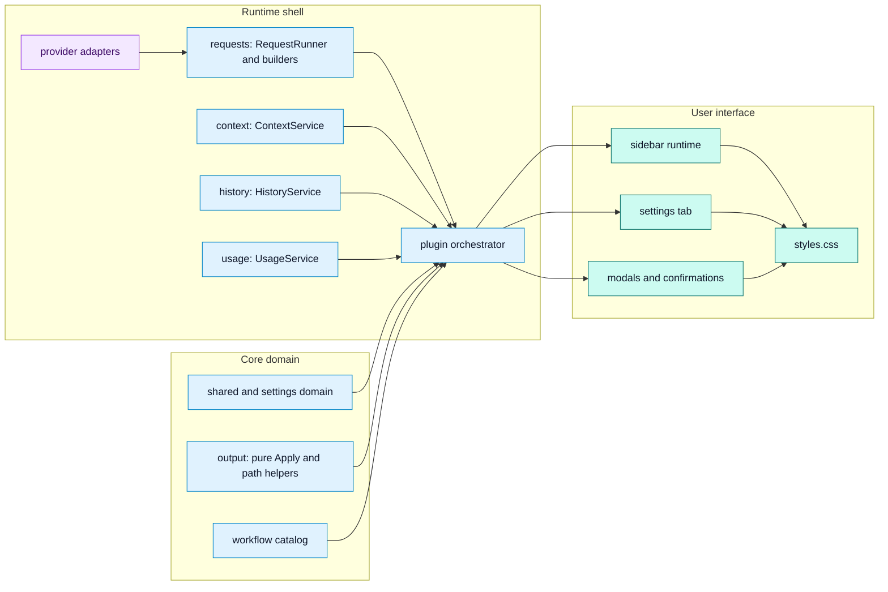

# Module Breakdown

## Purpose

Break the codebase into modules, responsibilities, likely ownership, and important files.

## Diagram

```mermaid
flowchart LR
  Shared["shared and settings domain"] --> Plugin["plugin orchestrator"]
  Providers["provider adapters"] --> Runner["requests: RequestRunner and builders"]
  Runner --> Plugin
  Context["context: ContextService"] --> Plugin
  History["history: HistoryService"] --> Plugin
  Usage["usage: UsageService"] --> Plugin
  Output["output: pure Apply and path helpers"] --> Plugin
  Workflows["workflow catalog"] --> Plugin
  Plugin --> Sidebar["sidebar runtime"]
  Plugin --> SettingsTab["settings tab"]
  Plugin --> Modals["modals and confirmations"]
  Sidebar --> Styles["styles.css"]
  SettingsTab --> Styles
  Modals --> Styles

  subgraph "Core domain"
    Shared
    Workflows
    Output
  end

  subgraph "Runtime shell"
    Plugin
    Context
    Runner
    History
    Usage
    Providers
  end

  subgraph "User interface"
    Sidebar
    SettingsTab
    Modals
    Styles
  end

  classDef core fill:#E0F2FE,stroke:#0284C7,color:#0F172A
  classDef config fill:#F1F5F9,stroke:#64748B,color:#0F172A
  classDef external fill:#F3E8FF,stroke:#9333EA,color:#3B0764
  classDef user fill:#CCFBF1,stroke:#0F766E,color:#0F172A

  class Shared,Workflows,Output core
  class Plugin,Context,Runner,History,Usage core
  class Providers external
  class Sidebar,SettingsTab,Modals,Styles user
```

## Module responsibility table

| Module | Main responsibility | Important files | Inferred likely owner |
| --- | --- | --- | --- |
| Plugin core | Lifecycle, settings load and save, commands, vault rename and delete events, Apply, result notes, images, batch runs, review queue Apply. Delegates to the services below. | `src/plugin/AskMatePlugin.ts` | Core maintainer |
| Context service | Remembered Markdown view and file, selection or full note fallback, Excalidraw and Kanban text, extra note, folder, thread and note history attachments. | `src/context/ContextService.ts` | Core maintainer |
| Request runner | Builds `AskRequest`, classifies intent, calls providers, reads incomplete or refused output, plans and generates images, records usage through the host. | `src/requests/RequestRunner.ts` | Core maintainer |
| Request builders | Pure prompt and context assembly with a primary-first budget, evidence sources, untrusted-content rule and delimiter escaping. | `src/requests/requestBuilders.ts`, `src/requests/promptSafety.ts` | Prompt and product maintainer |
| History service | Note history turns, review queue items and limits, rename and delete handling. | `src/history/HistoryService.ts` | Core maintainer |
| Usage service | Usage records, per-day totals, daily and monthly budgets, reset. | `src/usage/UsageService.ts` | Core maintainer |
| Output helpers | Heading sections, frontmatter split, section splice, file names and paths, templates, result backlinks. | `src/output/*` | Core maintainer |
| Sidebar UI | Composer, workflow grid, request preview, active run state, rendering responses and image actions. | `src/ui/sidebar/AskMateView.ts`, `styles.css` | UI maintainer |
| Reply render safety | Pure helpers that neutralise remote images, network-loading HTML and plugin code blocks in model output. | `src/ui/sidebar/renderSafety.ts` | UI maintainer |
| Settings UI | Provider config, context controls, workflow automation, review queue, usage stats. | `src/ui/settings/AskMateSettingTab.ts`, `src/ui/settings/settingsInputs.ts` | Settings maintainer |
| Modals | Confirmations, diff preview, prompt inspector, text viewer, note history. | `src/ui/modals/modals.ts` | UI maintainer |
| Providers | Provider-specific endpoints, request bodies, response parsing, model refresh. | `src/providers/*` | Integration maintainer |
| Shared model | Type definitions for settings, requests, outputs, workflows, queues, usage. | `src/shared/types.ts`, `src/shared/core.ts` | Core maintainer |
| Shared helpers | Image intent detection, Markdown diff, run identity and selection identity, model capabilities. | `src/shared/imageIntent.ts`, `src/shared/markdownDiff.ts`, `src/shared/trustSafety.ts`, `src/shared/modelCapabilities.ts` | Core maintainer |
| Settings domain | Defaults, constants, migration, normalization, validation helpers, in-place settings sync. | `src/settings/constants.ts`, `src/settings/defaults.ts`, `src/settings/normalize.ts`, `src/settings/syncInPlace.ts` | Core maintainer |
| Workflows | Built-in workflow prompts and command IDs. | `src/workflows/builtInWorkflows.ts` | Prompt and product maintainer |
| Validation | Smoke tests, `bun test` unit tests, build, CI and release checks. | `scripts/roadmap-smoke-tests.ts`, `tests/*.test.ts`, `package.json`, `.github/workflows/ci.yml`, `.github/workflows/release.yml` | Release maintainer |

## Notes

The architecture is still centred on `AskMatePlugin`, which owns Apply and vault writes, so write-safety checks stay in one place. Context capture, request running, history and usage now live in services that receive a small host object from the plugin, and the pure helpers in `src/requests`, `src/output`, `src/shared` and `src/ui/sidebar/renderSafety.ts` are unit-tested directly. `AskMatePlugin.ts` is still the largest file and the place where unrelated features most often interact. The shared model and settings normalizers are the best starting point when adding new persisted behavior because UI and plugin code both depend on them.

## Traceability

| Field | Details |
| --- | --- |
| Source files inspected | `src/plugin/AskMatePlugin.ts`, `src/context/*`, `src/requests/*`, `src/history/*`, `src/usage/*`, `src/output/*`, `src/ui/sidebar/AskMateView.ts`, `src/ui/sidebar/renderSafety.ts`, `src/ui/settings/*`, `src/ui/modals/modals.ts`, `src/providers/*`, `src/settings/*`, `src/shared/*`, `src/workflows/builtInWorkflows.ts`, `styles.css`, `scripts/roadmap-smoke-tests.ts`, `tests/*` |
| Key symbols | `AskMatePlugin`, `ContextService`, `RequestRunner`, `HistoryService`, `UsageService`, `AskMateView`, `AskMateSettingTab`, `AskMateDiffConfirmModal`, `ProviderRuntime`, `DEFAULT_SETTINGS`, `normalizeReviewQueueItems`, `syncObjectInPlace`, `WORKFLOWS` |
| Inferences | Likely owner labels are inferred from module responsibility, not declared in a CODEOWNERS file. |
| Confidence | confirmed |
| Open questions | None. |
