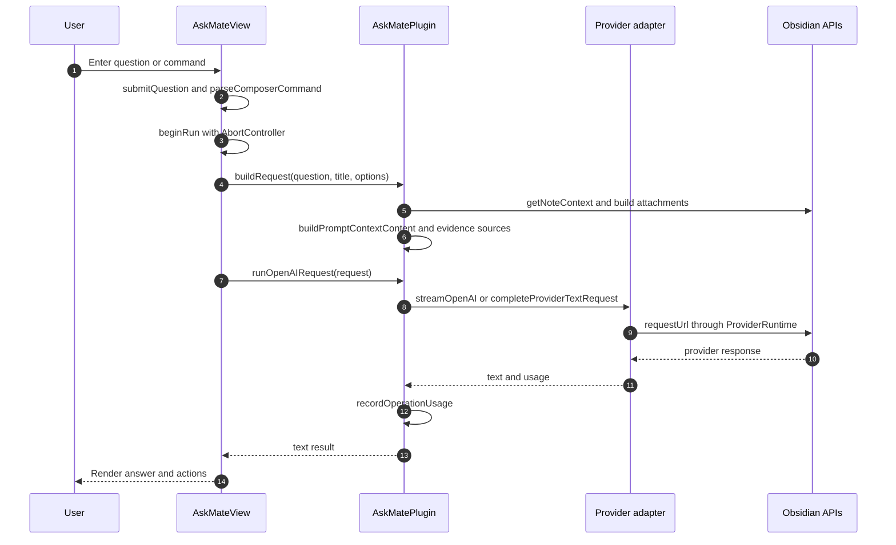
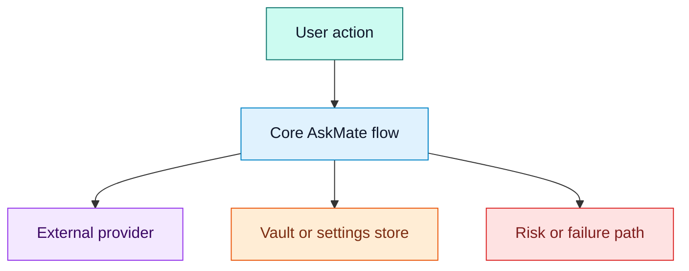
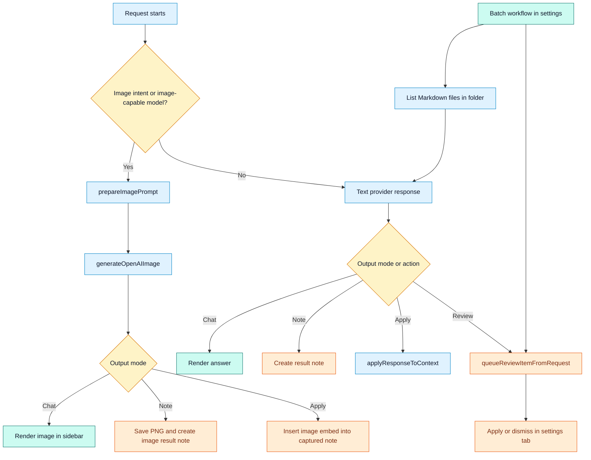

# Request Or Control Flow

## Purpose

Show the main runtime flows for text requests, image generation, workflows, Apply, review queue, and batch processing.

## Diagram: sidebar text request

## Diagram: flow styling legend

## Diagram: image, Apply, review queue, and batch branches

## Notes

`AskMateView` gates concurrent requests with `activeRun` and an `AbortController`. `AskMatePlugin.buildRequest()` classifies intent, captures note context, applies privacy and context budget settings, builds context attachments, expands workflow prompts, and creates evidence sources for text requests. `runOpenAIRequest()` then chooses text or image behavior. Text requests go to OpenAI Responses for the OpenAI provider or to the provider dispatcher for other providers. Image requests use OpenAI image generation after optional prompt planning.

Apply and review queue flows are safety-sensitive because they modify vault content. `applyResponseToContext()` chooses selected text, append, heading, or full-note behavior and routes through confirmations or diff previews depending on settings.

## Traceability

| Field | Details |
| --- | --- |
| Source files inspected | `src/ui/sidebar/AskMateView.ts`, `src/plugin/AskMatePlugin.ts`, `src/providers/index.ts`, `src/providers/open-ai.ts`, `src/shared/types.ts`, `src/ui/settings/AskMateSettingTab.ts` |
| Key symbols | `submitQuestion`, `runRequest`, `beginRun`, `buildRequest`, `runOpenAIRequest`, `completeProviderTextRequest`, `prepareImagePrompt`, `generateOpenAIImage`, `applyResponseToContext`, `queueReviewItemFromRequest`, `runBatchWorkflow` |
| Inferences | The batch path is simplified as a loop over Markdown files. The implementation records per-file success and failure details. |
| Confidence | confirmed |
| Open questions | Manual cancellation behavior should be tested against slow real providers. |
