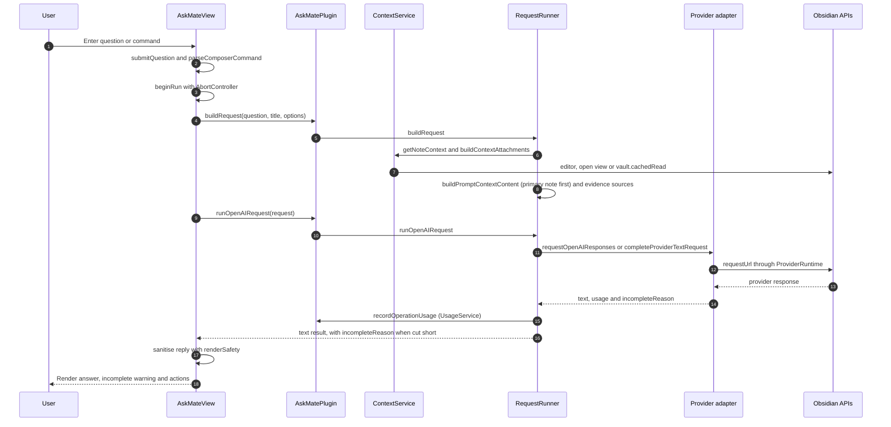
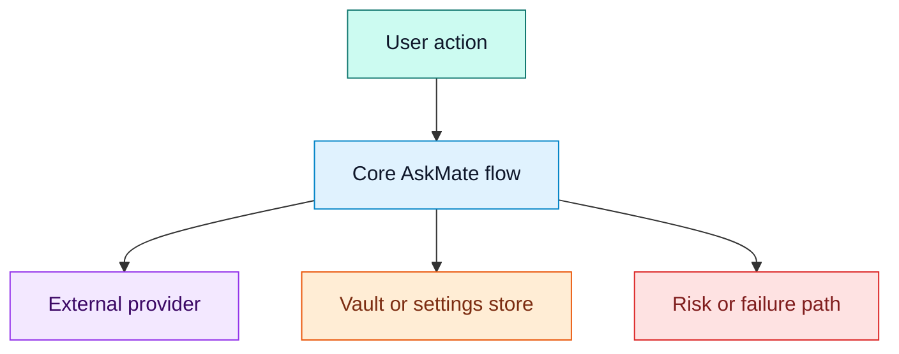
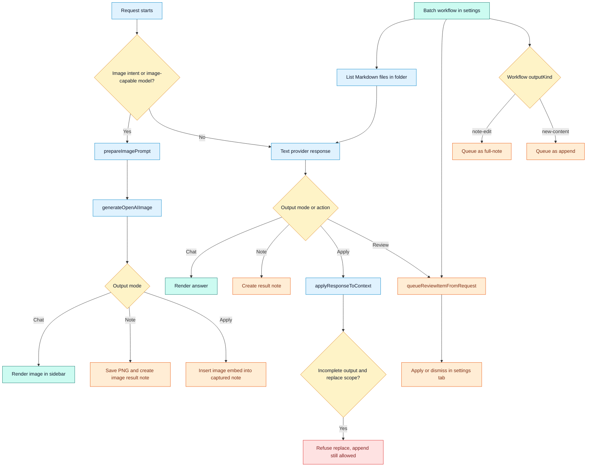

# Request Or Control Flow

## Purpose

Show the main runtime flows for text requests, image generation, workflows, Apply, review queue, and batch processing.

## Diagram: sidebar text request

```mermaid
sequenceDiagram
  autonumber
  participant User as User
  participant View as AskMateView
  participant Plugin as AskMatePlugin
  participant Context as ContextService
  participant Runner as RequestRunner
  participant Provider as Provider adapter
  participant Obsidian as Obsidian APIs

  User->>View: Enter question or command
  View->>View: submitQuestion and parseComposerCommand
  View->>View: beginRun with AbortController
  View->>Plugin: buildRequest(question, title, options)
  Plugin->>Runner: buildRequest
  Runner->>Context: getNoteContext and buildContextAttachments
  Context->>Obsidian: editor, open view or vault.cachedRead
  Runner->>Runner: buildPromptContextContent (primary note first) and evidence sources
  View->>Plugin: runOpenAIRequest(request)
  Plugin->>Runner: runOpenAIRequest
  Runner->>Provider: requestOpenAIResponses or completeProviderTextRequest
  Provider->>Obsidian: requestUrl through ProviderRuntime
  Obsidian-->>Provider: provider response
  Provider-->>Runner: text, usage and incompleteReason
  Runner->>Plugin: recordOperationUsage (UsageService)
  Runner-->>View: text result, with incompleteReason when cut short
  View->>View: sanitise reply with renderSafety
  View-->>User: Render answer, incomplete warning and actions
```

## Diagram: flow styling legend

```mermaid
flowchart TD
  U["User action"] --> C["Core AskMate flow"]
  C --> E["External provider"]
  C --> S["Vault or settings store"]
  C --> R["Risk or failure path"]

  classDef user fill:#CCFBF1,stroke:#0F766E,color:#0F172A
  classDef core fill:#E0F2FE,stroke:#0284C7,color:#0F172A
  classDef external fill:#F3E8FF,stroke:#9333EA,color:#3B0764
  classDef store fill:#FFEDD5,stroke:#EA580C,color:#7C2D12
  classDef risk fill:#FEE2E2,stroke:#DC2626,color:#7F1D1D

  class U user
  class C core
  class E external
  class S store
  class R risk
```

## Diagram: image, Apply, review queue, and batch branches

```mermaid
flowchart TD
  Start["Request starts"] --> Intent{"Image intent or image-capable model?"}
  Intent -- "Yes" --> Plan["prepareImagePrompt"]
  Plan --> Image["generateOpenAIImage"]
  Image --> ImageOutput{"Output mode"}
  ImageOutput -- "Chat" --> ChatImage["Render image in sidebar"]
  ImageOutput -- "Note" --> ImageNote["Save PNG and create image result note"]
  ImageOutput -- "Apply" --> InsertImage["Insert image embed into captured note"]

  Intent -- "No" --> Text["Text provider response"]
  Text --> TextOutput{"Output mode or action"}
  TextOutput -- "Chat" --> ChatText["Render answer"]
  TextOutput -- "Note" --> ResultNote["Create result note"]
  TextOutput -- "Apply" --> Apply["applyResponseToContext"]
  TextOutput -- "Review" --> Queue["queueReviewItemFromRequest"]
  Queue --> Settings["Apply or dismiss in settings tab"]
  Apply --> Incomplete{"Incomplete output and replace scope?"}
  Incomplete -- "Yes" --> Refuse["Refuse replace, append still allowed"]

  Batch["Batch workflow in settings"] --> FileLoop["List Markdown files in folder"]
  FileLoop --> Text
  Batch --> Queue
  Batch --> Kind{"Workflow outputKind"}
  Kind -- "note-edit" --> QueueFull["Queue as full-note"]
  Kind -- "new-content" --> QueueAppend["Queue as append"]

  classDef core fill:#E0F2FE,stroke:#0284C7,color:#0F172A
  classDef decision fill:#FEF3C7,stroke:#D97706,color:#0F172A
  classDef store fill:#FFEDD5,stroke:#EA580C,color:#7C2D12
  classDef risk fill:#FEE2E2,stroke:#DC2626,color:#7F1D1D
  classDef user fill:#CCFBF1,stroke:#0F766E,color:#0F172A

  class Start,Plan,Image,Text,Apply,FileLoop core
  class Intent,ImageOutput,TextOutput,Incomplete,Kind decision
  class ImageNote,InsertImage,ResultNote,Queue,Settings,QueueFull,QueueAppend store
  class Refuse risk
  class Batch,ChatImage,ChatText user
```

## Notes

`AskMateView` gates concurrent requests with `activeRun` and an `AbortController`. `AskMatePlugin.buildRequest()` delegates to `RequestRunner.buildRequest()`, which classifies intent (`classifyRequestIntent`, using `shouldGenerateImage` from `src/shared/imageIntent.ts` and the `autoImageIntentEnabled` setting), captures note context through `ContextService`, applies privacy and context budget settings, builds context attachments, expands workflow prompts, and creates evidence sources for text requests. `RequestRunner.runOpenAIRequest()` then chooses text or image behaviour. Text requests go to the OpenAI Responses API (`store: false`) for the OpenAI provider or to `completeProviderTextRequest()` for other providers. Every path reports an `incompleteReason` when the reply was cut short or filtered, and the runner copies it to `request.metadata.outputIncompleteReason`. Image requests always use OpenAI image generation after optional prompt planning, whichever chat provider is selected.

Apply and review queue flows are safety-sensitive because they modify vault content. `applyResponseToContext()` chooses selected text, append, heading, or full-note behaviour and routes through confirmations or diff previews depending on settings. Replace scopes are refused when `outputIncompleteReason` is set and need confirmation when `primaryContextTruncated` is set. Review queue apply and dismiss update items by id on the live `settings.reviewQueue`.

## Traceability

| Field | Details |
| --- | --- |
| Source files inspected | `src/ui/sidebar/AskMateView.ts`, `src/plugin/AskMatePlugin.ts`, `src/requests/RequestRunner.ts`, `src/requests/requestBuilders.ts`, `src/context/ContextService.ts`, `src/shared/imageIntent.ts`, `src/providers/index.ts`, `src/providers/open-ai.ts`, `src/shared/types.ts`, `src/ui/settings/AskMateSettingTab.ts` |
| Key symbols | `submitQuestion`, `runRequest`, `beginRun`, `buildRequest`, `classifyRequestIntent`, `shouldGenerateImage`, `runOpenAIRequest`, `requestOpenAIResponses`, `completeProviderTextRequest`, `prepareImagePrompt`, `generateOpenAIImage`, `applyResponseToContext`, `queueReviewItemFromRequest`, `runBatchWorkflow` |
| Inferences | The batch path is simplified as a loop over Markdown files. The implementation records per-file success and failure details, and counts an incomplete result as a failure. |
| Confidence | confirmed |
| Open questions | Manual cancellation behavior should be tested against slow real providers. |
