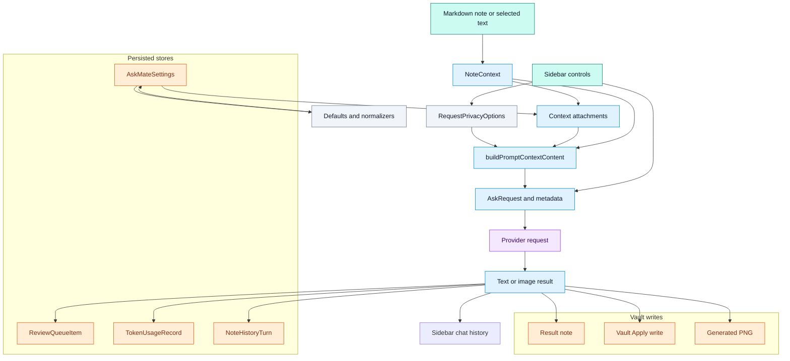

# Data Flow

## Purpose

Show inputs, transformations, persistence, output paths, and validation points.

## Diagram

## Notes

The primary data path starts with selected text or the current Markdown note. `getNoteContext()` prefers explicit editor context, then active Markdown view, then remembered Markdown context, then cached file reads. `buildRequest()` merges privacy defaults with request options, builds optional context attachments, applies context budget truncation, and stores metadata describing the request.

Persisted state lives in plugin settings through `loadData()` and `saveData()`. Raw provider API keys are not stored in settings. Settings store secret names, and the plugin retrieves secrets from Obsidian `SecretStorage`.

## Context attachment sources

| Attachment kind | Source setting or behavior | Primary files |
| --- | --- | --- |
| `thread_history` | Recent sidebar chat turns when threaded chat is enabled. | `src/plugin/AskMatePlugin.ts`, `src/shared/types.ts` |
| `note_history` | Past AskMate turns for the current note. | `src/plugin/AskMatePlugin.ts`, `src/settings/defaults.ts` |
| `additional_note` | User configured additional note paths. | `src/plugin/AskMatePlugin.ts`, `src/settings/normalize.ts` |
| `folder_note` | Folder context path and limits. | `src/plugin/AskMatePlugin.ts`, `src/settings/defaults.ts` |
| `style_guide` | Optional role context path. | `src/plugin/AskMatePlugin.ts`, `src/settings/defaults.ts` |
| `glossary` | Optional glossary context path. | `src/plugin/AskMatePlugin.ts`, `src/settings/defaults.ts` |
| `excalidraw_summary` | Extracted summaries from Excalidraw files. | `src/plugin/AskMatePlugin.ts`, `scripts/roadmap-smoke-tests.ts` |
| `image_manifest` | Image references from notes when enabled. | `src/plugin/AskMatePlugin.ts`, `src/shared/types.ts` |

## Traceability

| Field | Details |
| --- | --- |
| Source files inspected | `src/plugin/AskMatePlugin.ts`, `src/shared/types.ts`, `src/settings/defaults.ts`, `src/settings/normalize.ts`, `src/ui/sidebar/AskMateView.ts` |
| Key symbols | `NoteContext`, `ContextAttachment`, `AskRequest`, `AskRequestMetadata`, `buildRequest`, `buildContextAttachments`, `buildPromptContextContent`, `ReviewQueueItem`, `TokenUsageRecord`, `NoteHistoryTurn` |
| Inferences | Chat history in the sidebar is runtime UI state, while note history and usage stats are persisted through settings. |
| Confidence | confirmed |
| Open questions | Manual testing should verify which attachments appear for each privacy toggle combination. |
