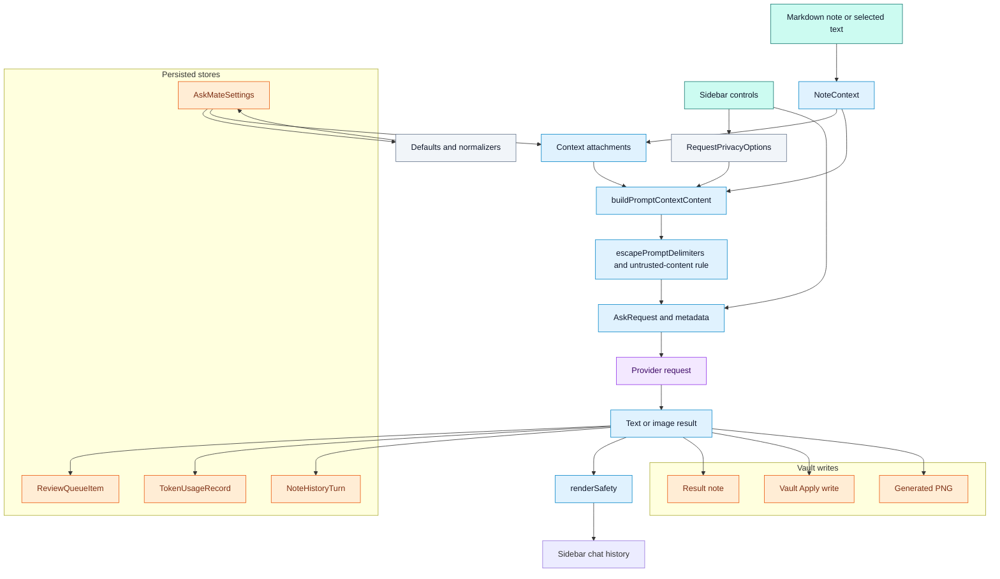

# Data Flow

## Purpose

Show inputs, transformations, persistence, output paths, and validation points.

## Diagram

```mermaid
flowchart TD
  Note["Markdown note or selected text"] --> Context["NoteContext"]
  Sidebar["Sidebar controls"] --> Privacy["RequestPrivacyOptions"]
  Settings["AskMateSettings"] --> Defaults["Defaults and normalizers"]
  Defaults --> Settings

  Context --> Attachments["Context attachments"]
  Settings --> Attachments
  Privacy --> PromptContext["buildPromptContextContent"]
  Attachments --> PromptContext
  Context --> PromptContext
  PromptContext --> Escape["escapePromptDelimiters and untrusted-content rule"]
  Escape --> Request["AskRequest and metadata"]
  Sidebar --> Request
  Request --> Provider["Provider request"]
  Provider --> Result["Text or image result"]

  Result --> Sanitise["renderSafety"]
  Sanitise --> Chat["Sidebar chat history"]
  Result --> ResultNote["Result note"]
  Result --> Apply["Vault Apply write"]
  Result --> ReviewQueue["ReviewQueueItem"]
  Result --> Usage["TokenUsageRecord"]
  Result --> History["NoteHistoryTurn"]

  subgraph "Persisted stores"
    Settings
    ReviewQueue
    Usage
    History
  end

  subgraph "Vault writes"
    ResultNote
    Apply
    ImageFile["Generated PNG"]
  end

  Result --> ImageFile

  classDef user fill:#CCFBF1,stroke:#0F766E,color:#0F172A
  classDef core fill:#E0F2FE,stroke:#0284C7,color:#0F172A
  classDef store fill:#FFEDD5,stroke:#EA580C,color:#7C2D12
  classDef external fill:#F3E8FF,stroke:#9333EA,color:#3B0764
  classDef config fill:#F1F5F9,stroke:#64748B,color:#0F172A

  class Note,Sidebar user
  class Context,Attachments,PromptContext,Escape,Request,Result,Sanitise core
  class Settings,ReviewQueue,Usage,History,ResultNote,Apply,ImageFile store
  class Provider external
  class Privacy,Defaults config
```

## Notes

The primary data path starts with selected text or the current Markdown note. `ContextService.getNoteContext()` prefers explicit editor context, then the active Markdown view, then the last open or remembered Markdown view or file, then `vault.cachedRead`. `RequestRunner.buildRequest()` merges privacy defaults with request options, builds optional context attachments through `ContextService.buildContextAttachments()`, and stores metadata describing the request. `buildPromptContextContent()` spends the context budget on the primary note or selection first, then on attachments, and sets `primaryTruncated`; the runner records it as `metadata.primaryContextTruncated`. Untrusted note, attachment and evidence text has AskMate's delimiter tags escaped by `escapePromptDelimiters()`.

Persisted state lives in plugin data (`data.json`) through `loadData()` and `saveData()`: settings, note history turns (question and answer text, on by default), review queue items (pending items keep `beforeText` and `proposedText`; applied and dismissed items keep only metadata), and usage records with per-day totals (`totalsByDay`). Note history and review items follow vault renames and are dropped on delete. Raw provider API keys are not stored in settings. Settings store secret names, and the plugin retrieves secrets from Obsidian `SecretStorage`. `saveSettings()` normalises and then syncs into the live settings object with `syncObjectInPlace()`, so nested references stay valid.

## Context attachment sources

| Attachment kind | Source setting or behavior | Primary files |
| --- | --- | --- |
| `thread_history` | Recent sidebar chat turns when threaded chat is enabled. | `src/context/ContextService.ts`, `src/shared/types.ts` |
| `note_history` | Past AskMate turns for the current note. | `src/context/ContextService.ts`, `src/settings/defaults.ts` |
| `additional_note` | User configured additional note paths. | `src/context/ContextService.ts`, `src/settings/normalize.ts` |
| `folder_note` | Folder context path and limits. | `src/context/ContextService.ts`, `src/settings/defaults.ts` |
| `style_guide` | Optional role context path. | `src/context/ContextService.ts`, `src/settings/defaults.ts` |
| `glossary` | Optional glossary context path. | `src/context/ContextService.ts`, `src/settings/defaults.ts` |
| `excalidraw_summary` | Extracted summaries from Excalidraw files. | `src/context/ContextService.ts`, `scripts/roadmap-smoke-tests.ts` |
| `image_manifest` | Image references from notes when enabled. | `src/context/ContextService.ts`, `src/shared/types.ts` |

## Traceability

| Field | Details |
| --- | --- |
| Source files inspected | `src/plugin/AskMatePlugin.ts`, `src/context/ContextService.ts`, `src/requests/RequestRunner.ts`, `src/requests/requestBuilders.ts`, `src/requests/promptSafety.ts`, `src/history/HistoryService.ts`, `src/usage/UsageService.ts`, `src/settings/syncInPlace.ts`, `src/shared/types.ts`, `src/settings/defaults.ts`, `src/settings/normalize.ts`, `src/ui/sidebar/AskMateView.ts`, `src/ui/sidebar/renderSafety.ts` |
| Key symbols | `NoteContext`, `ContextAttachment`, `AskRequest`, `AskRequestMetadata`, `buildRequest`, `buildContextAttachments`, `buildPromptContextContent`, `escapePromptDelimiters`, `ReviewQueueItem`, `TokenUsageRecord`, `NoteHistoryTurn`, `syncObjectInPlace` |
| Inferences | Chat history in the sidebar is runtime UI state, while note history and usage stats are persisted through settings. |
| Confidence | confirmed |
| Open questions | Manual testing should verify which attachments appear for each privacy toggle combination. |
