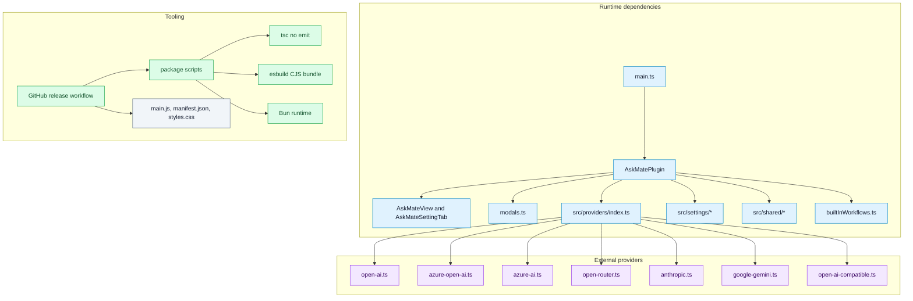

# Dependency Map

## Purpose

Show internal module dependencies, external provider dependencies, and build or release dependencies.

## Diagram

## Runtime dependencies

| Dependency | Evidence | Notes |
| --- | --- | --- |
| Obsidian plugin API | `manifest.json`, imports from `obsidian` | Desktop-only plugin with `minAppVersion` `1.11.4`. |
| Provider APIs | `src/providers/*`, `README.md` | OpenAI, Azure OpenAI, Azure AI Foundry, OpenRouter, Anthropic, Gemini, local OpenAI-compatible. |
| Obsidian `requestUrl` | `AskMatePlugin.requestJson()` | Required by project review rules and provider runtime. |
| Obsidian `SecretStorage` | `getProviderApiKey()` | Settings hold secret names, not raw keys. |
| Obsidian vault API | `vault.create`, `vault.createBinary`, `vault.modify`, `vault.cachedRead` | Used for result notes, images, Apply, and context. |

## Tooling dependencies

| Tool | Evidence | Purpose |
| --- | --- | --- |
| Bun | `package.json`, `.github/workflows/release.yml` | Scripts, tests, build, release CI setup. |
| TypeScript | `package.json`, `tsconfig.json` | Strict type checking before build. |
| esbuild | `esbuild.config.mjs` | Bundles `main.ts` to `main.js` as CJS targeting ES2018. |
| GitHub Actions | `.github/workflows/release.yml` | Version validation, tests, build, asset attestation, release. |

## Traceability

| Field | Details |
| --- | --- |
| Source files inspected | `main.ts`, `package.json`, `manifest.json`, `tsconfig.json`, `esbuild.config.mjs`, `.github/workflows/release.yml`, `src/providers/*`, `src/plugin/AskMatePlugin.ts` |
| Key symbols | `completeProviderTextRequest`, `fetchProviderModels`, `requestOpenAIResponses`, `requestOpenAIImageGeneration`, `ProviderRuntime`, `requestJson` |
| Inferences | Provider files are grouped by external service, while local OpenAI-compatible endpoints are treated as an external boundary because they are reached by HTTP. |
| Confidence | confirmed |
| Open questions | Exact provider feature support should be checked against live APIs before changing adapter behavior. |
