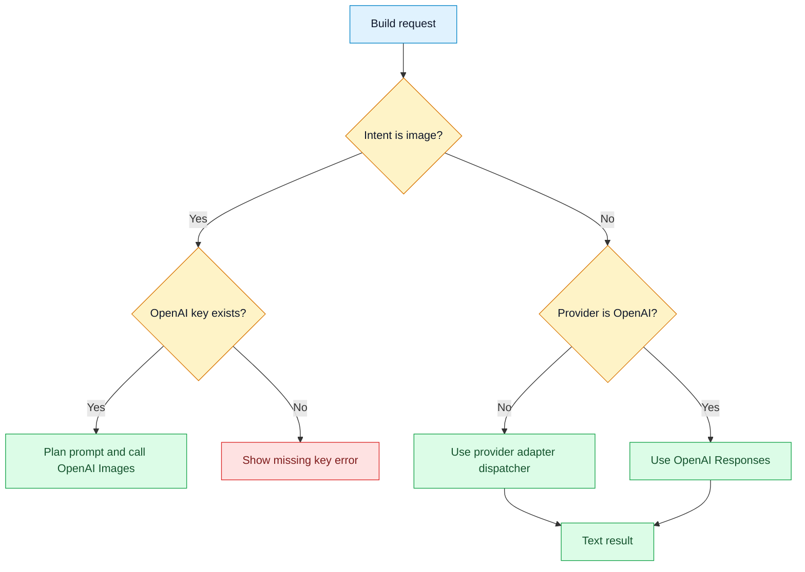
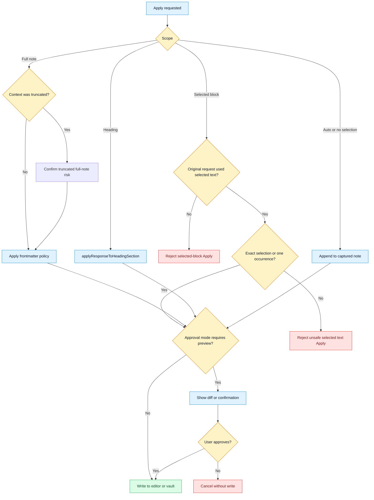
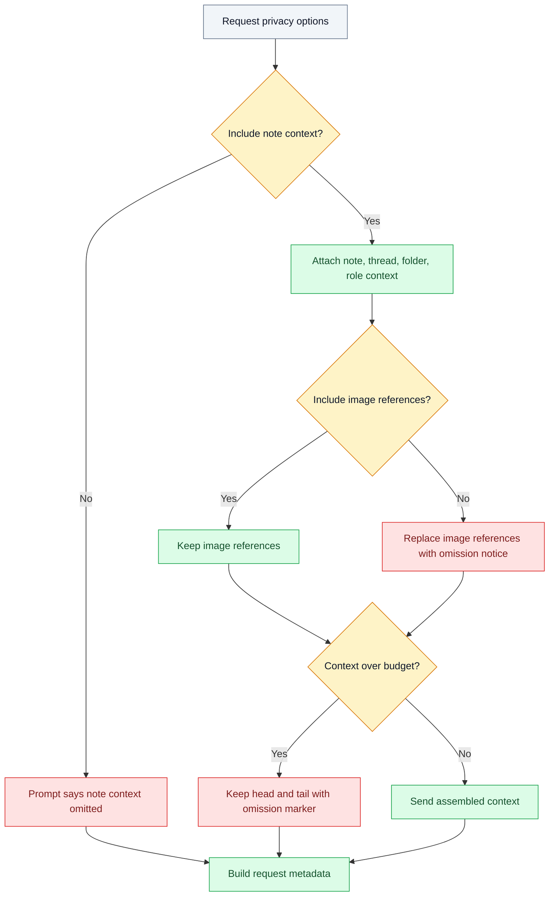
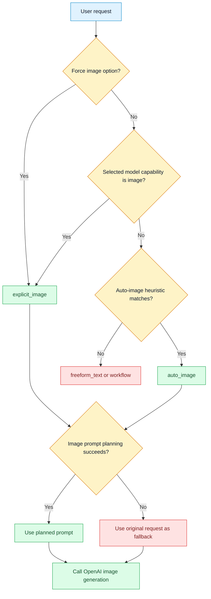
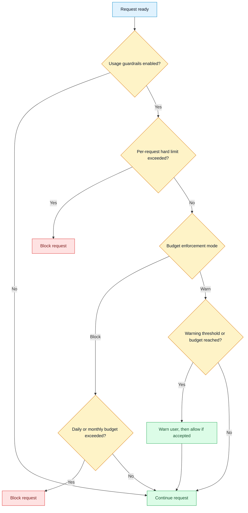

# Decision Trees

## Purpose

Show key branching logic for intent, provider routing, privacy, Apply, and usage guardrails.

## Diagram: request intent and provider route

## Diagram: Apply scope and approval

## Diagram: privacy and context budget

## Diagram: image intent and planning fallback

## Diagram: usage guardrails

## Notes

The code uses explicit request metadata to record intent, provider, privacy, context budget, evidence, and output mode. Apply approval mode controls user confirmation paths, but documented contributor rules require hard safety checks to remain regardless of approval mode.

## Traceability

| Field | Details |
| --- | --- |
| Source files inspected | `src/plugin/AskMatePlugin.ts`, `src/shared/types.ts`, `src/settings/normalize.ts`, `src/settings/defaults.ts`, `CONTRIBUTING.md`, `README.md`, `scripts/roadmap-smoke-tests.ts` |
| Key symbols | `RequestIntentKind`, `buildRequest`, `runOpenAIRequest`, `normalizeApplyScope`, `applyResponseToContext`, `confirmTextApplyPreview`, `confirmTruncatedContextFullApply`, `buildPromptContextContent`, `usageGuardrailsEnabled` |
| Inferences | Usage guardrail details are summarized at a high level because this file focuses on request and Apply branch shape. |
| Confidence | confirmed |
| Open questions | Add a focused DigVis update if future guardrail logic becomes more complex. |
