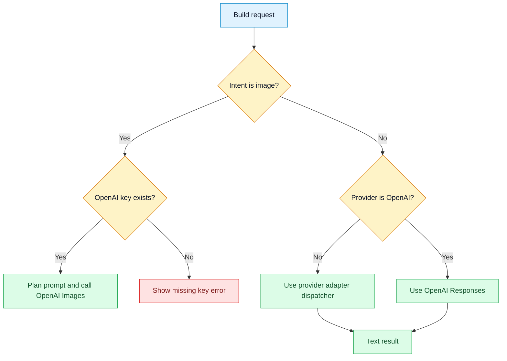
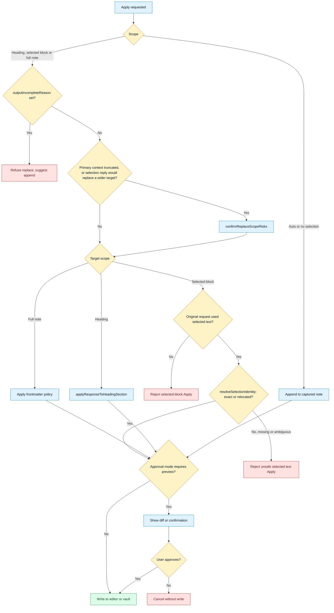
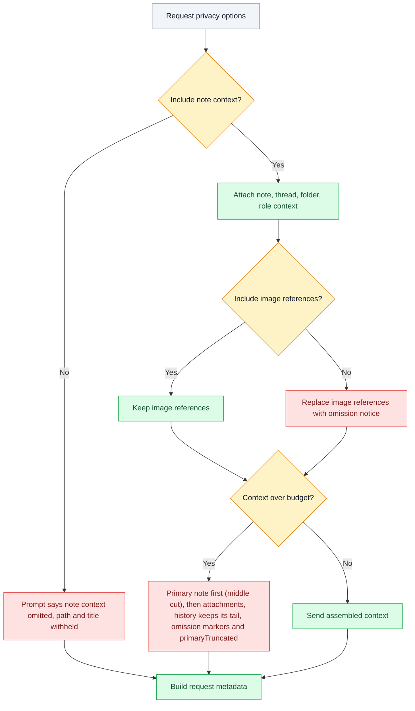
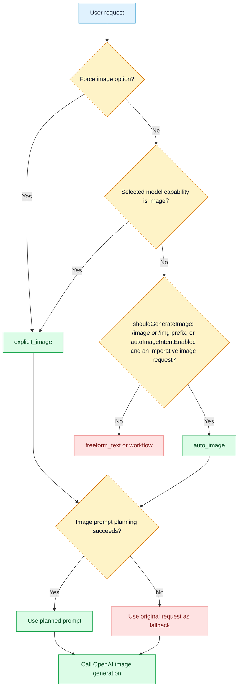
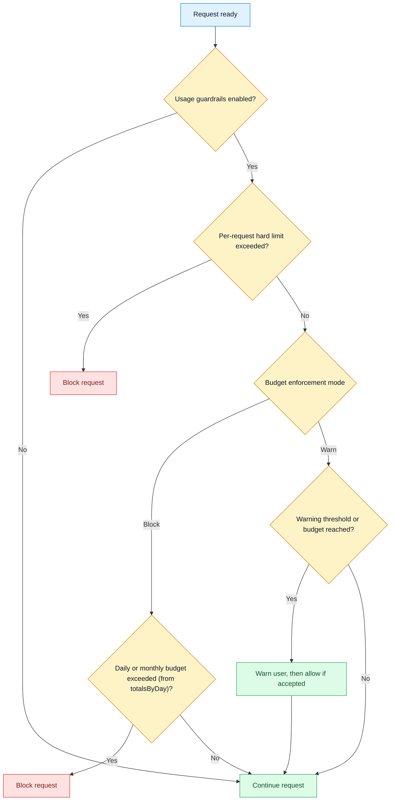

# Decision Trees

## Purpose

Show key branching logic for intent, provider routing, privacy, Apply, and usage guardrails.

## Diagram: request intent and provider route

```mermaid
flowchart TD
  Start["Build request"] --> Intent{"Intent is image?"}
  Intent -- "Yes" --> OpenAIKey{"OpenAI key exists?"}
  OpenAIKey -- "Yes" --> Image["Plan prompt and call OpenAI Images"]
  OpenAIKey -- "No" --> ImageError["Show missing key error"]
  Intent -- "No" --> Provider{"Provider is OpenAI?"}
  Provider -- "Yes" --> Responses["Use OpenAI Responses"]
  Provider -- "No" --> Adapter["Use provider adapter dispatcher"]
  Adapter --> Text["Text result"]
  Responses --> Text

  classDef start fill:#E0F2FE,stroke:#0284C7,color:#0F172A
  classDef decision fill:#FEF3C7,stroke:#D97706,color:#0F172A
  classDef yes fill:#DCFCE7,stroke:#16A34A,color:#14532D
  classDef no fill:#FEE2E2,stroke:#DC2626,color:#7F1D1D
  classDef external fill:#F3E8FF,stroke:#9333EA,color:#3B0764

  class Start start
  class Intent,OpenAIKey,Provider decision
  class Image,Responses,Adapter,Text yes
  class ImageError no
```

## Diagram: Apply scope and approval

```mermaid
flowchart TD
  Apply["Apply requested"] --> Scope{"Scope"}
  Scope -- "Heading, selected block or full note" --> Complete{"outputIncompleteReason set?"}
  Complete -- "Yes" --> IncompleteError["Refuse replace, suggest append"]
  Complete -- "No" --> Risk{"Primary context truncated, or selection reply would replace a wider target?"}
  Risk -- "Yes" --> ConfirmRisk["confirmReplaceScopeRisks"]
  Risk -- "No" --> Target{"Target scope"}
  ConfirmRisk --> Target
  Target -- "Heading" --> Heading["applyResponseToHeadingSection"]
  Target -- "Selected block" --> SelectedSource{"Original request used selected text?"}
  SelectedSource -- "Yes" --> ExactMatch{"resolveSelectionIdentity: exact or relocated?"}
  SelectedSource -- "No" --> SelectedError["Reject selected-block Apply"]
  ExactMatch -- "Yes" --> Preview{"Approval mode requires preview?"}
  ExactMatch -- "No, missing or ambiguous" --> MatchError["Reject unsafe selected text Apply"]
  Scope -- "Auto or no selection" --> Append["Append to captured note"]
  Target -- "Full note" --> Frontmatter["Apply frontmatter policy"]
  Frontmatter --> Preview
  Heading --> Preview
  Append --> Preview
  Preview -- "Yes" --> Diff["Show diff or confirmation"]
  Preview -- "No" --> Write["Write to editor or vault"]
  Diff --> UserChoice{"User approves?"}
  UserChoice -- "Yes" --> Write
  UserChoice -- "No" --> Cancel["Cancel without write"]

  classDef start fill:#E0F2FE,stroke:#0284C7,color:#0F172A
  classDef decision fill:#FEF3C7,stroke:#D97706,color:#0F172A
  classDef yes fill:#DCFCE7,stroke:#16A34A,color:#14532D
  classDef no fill:#FEE2E2,stroke:#DC2626,color:#7F1D1D
  classDef store fill:#FFEDD5,stroke:#EA580C,color:#7C2D12

  class Apply,Heading,Append,Frontmatter,Diff,ConfirmRisk start
  class Scope,Complete,Risk,Target,SelectedSource,ExactMatch,Preview,UserChoice decision
  class Write yes
  class SelectedError,MatchError,IncompleteError,Cancel no
```

## Diagram: privacy and context budget

```mermaid
flowchart TD
  Privacy["Request privacy options"] --> IncludeNote{"Include note context?"}
  IncludeNote -- "Yes" --> Attach["Attach note, thread, folder, role context"]
  IncludeNote -- "No" --> Omit["Prompt says note context omitted, path and title withheld"]
  Attach --> IncludeImages{"Include image references?"}
  IncludeImages -- "Yes" --> KeepImages["Keep image references"]
  IncludeImages -- "No" --> StripImages["Replace image references with omission notice"]
  KeepImages --> Budget{"Context over budget?"}
  StripImages --> Budget
  Budget -- "Yes" --> Truncate["Primary note first (middle cut), then attachments, history keeps its tail, omission markers and primaryTruncated"]
  Budget -- "No" --> Full["Send assembled context"]
  Omit --> Request["Build request metadata"]
  Truncate --> Request
  Full --> Request

  classDef decision fill:#FEF3C7,stroke:#D97706,color:#0F172A
  classDef yes fill:#DCFCE7,stroke:#16A34A,color:#14532D
  classDef no fill:#FEE2E2,stroke:#DC2626,color:#7F1D1D
  classDef config fill:#F1F5F9,stroke:#64748B,color:#0F172A
  classDef core fill:#E0F2FE,stroke:#0284C7,color:#0F172A

  class IncludeNote,IncludeImages,Budget decision
  class Attach,KeepImages,Full,Request yes
  class Omit,StripImages,Truncate no
  class Privacy config
```

## Diagram: image intent and planning fallback

```mermaid
flowchart TD
  UserRequest["User request"] --> Forced{"Force image option?"}
  Forced -- "Yes" --> ImageIntent["explicit_image"]
  Forced -- "No" --> ModelCap{"Selected model capability is image?"}
  ModelCap -- "Yes" --> ImageIntent
  ModelCap -- "No" --> Heuristic{"shouldGenerateImage: /image or /img prefix, or autoImageIntentEnabled and an imperative image request?"}
  Heuristic -- "Yes" --> AutoImage["auto_image"]
  Heuristic -- "No" --> TextIntent["freeform_text or workflow"]
  ImageIntent --> Plan{"Image prompt planning succeeds?"}
  AutoImage --> Plan
  Plan -- "Yes" --> Planned["Use planned prompt"]
  Plan -- "No" --> Fallback["Use original request as fallback"]
  Planned --> Generate["Call OpenAI image generation"]
  Fallback --> Generate

  classDef decision fill:#FEF3C7,stroke:#D97706,color:#0F172A
  classDef yes fill:#DCFCE7,stroke:#16A34A,color:#14532D
  classDef no fill:#FEE2E2,stroke:#DC2626,color:#7F1D1D
  classDef core fill:#E0F2FE,stroke:#0284C7,color:#0F172A

  class Forced,ModelCap,Heuristic,Plan decision
  class ImageIntent,AutoImage,Planned,Generate yes
  class TextIntent,Fallback no
  class UserRequest core
```

## Diagram: usage guardrails

```mermaid
flowchart TD
  Request["Request ready"] --> Enabled{"Usage guardrails enabled?"}
  Enabled -- "No" --> Continue["Continue request"]
  Enabled -- "Yes" --> HardLimit{"Per-request hard limit exceeded?"}
  HardLimit -- "Yes" --> BlockHard["Block request"]
  HardLimit -- "No" --> BudgetMode{"Budget enforcement mode"}
  BudgetMode -- "Block" --> BudgetExceeded{"Daily or monthly budget exceeded (from totalsByDay)?"}
  BudgetMode -- "Warn" --> WarnExceeded{"Warning threshold or budget reached?"}
  BudgetExceeded -- "Yes" --> BlockBudget["Block request"]
  BudgetExceeded -- "No" --> Continue
  WarnExceeded -- "Yes" --> Warn["Warn user, then allow if accepted"]
  WarnExceeded -- "No" --> Continue
  Warn --> Continue

  classDef decision fill:#FEF3C7,stroke:#D97706,color:#0F172A
  classDef yes fill:#DCFCE7,stroke:#16A34A,color:#14532D
  classDef no fill:#FEE2E2,stroke:#DC2626,color:#7F1D1D
  classDef core fill:#E0F2FE,stroke:#0284C7,color:#0F172A

  class Enabled,HardLimit,BudgetMode,BudgetExceeded,WarnExceeded decision
  class Continue,Warn yes
  class BlockHard,BlockBudget no
  class Request core
```

## Notes

The code uses explicit request metadata to record intent, provider, privacy, context budget, evidence, output mode, `primaryContextTruncated` and `outputIncompleteReason`. Apply approval mode controls user confirmation paths, but hard safety checks (incomplete-output refusal, replace-scope risk confirmation, selection identity resolution, captured-file targeting) apply regardless of approval mode. Selected-text Apply no longer needs exactly one occurrence: `resolveSelectionIdentity()` accepts the captured offsets when text and anchors still match, otherwise a single anchored or unique occurrence, and rejects missing or ambiguous text.

## Traceability

| Field | Details |
| --- | --- |
| Source files inspected | `src/plugin/AskMatePlugin.ts`, `src/requests/RequestRunner.ts`, `src/requests/requestBuilders.ts`, `src/usage/UsageService.ts`, `src/shared/imageIntent.ts`, `src/shared/trustSafety.ts`, `src/shared/types.ts`, `src/settings/normalize.ts`, `src/settings/defaults.ts`, `CONTRIBUTING.md`, `README.md`, `scripts/roadmap-smoke-tests.ts` |
| Key symbols | `RequestIntentKind`, `classifyRequestIntent`, `shouldGenerateImage`, `buildRequest`, `runOpenAIRequest`, `normalizeApplyScope`, `applyResponseToContext`, `assertOutputCompleteForReplace`, `confirmReplaceScopeRisks`, `resolveSelectionIdentity`, `confirmTextApplyPreview`, `buildPromptContextContent`, `evaluateUsageGuardrails`, `usageGuardrailsEnabled` |
| Inferences | Usage guardrail details are summarized at a high level because this file focuses on request and Apply branch shape. |
| Confidence | confirmed |
| Open questions | Add a focused DigVis update if future guardrail logic becomes more complex. |
