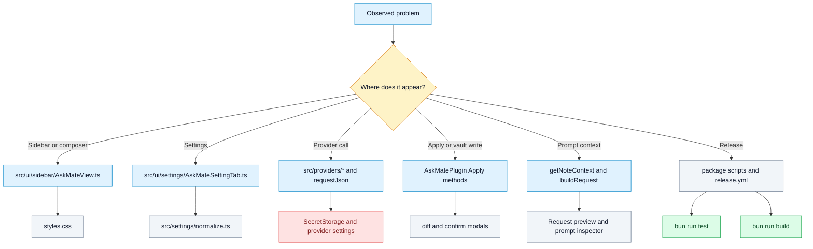

# Debugging Map

## Purpose

Show where developers should look first for common failures, logs, tests, config, and boundary bugs.

## Diagram

## Debugging starting points

| Symptom | Start here | Then inspect | Why |
| --- | --- | --- | --- |
| Sidebar cannot send or stop request | `src/ui/sidebar/AskMateView.ts` | `activeRun`, `beginRun`, `stopActiveRun`, `runRequest` | Sidebar owns run state and abort signals. |
| Wrong note context after sidebar focus | `src/plugin/AskMatePlugin.ts` | `getNoteContext`, `rememberActiveMarkdownContext`, `lastMarkdownView`, `lastNoteContext` | Context fallback is implemented in plugin core. |
| Provider error or missing models | `src/providers/index.ts` | Provider-specific file, `getProviderApiKey`, `requestJson` | Dispatcher and runtime mediate provider requests. |
| Apply writes wrong place or refuses write | `src/plugin/AskMatePlugin.ts` | `applyResponseToContext`, `appendResponseToCapturedNote`, `applyResponseToHeadingSection` | Apply safety and targeting live in plugin core. |
| Diff or confirmation issue | `src/ui/modals/modals.ts` | `src/shared/markdownDiff.ts`, `confirmTextApplyPreview` | UI confirmation is split from decision logic. |
| Settings value resets or migrates poorly | `src/settings/normalize.ts` | `src/settings/defaults.ts`, `src/shared/types.ts` | Normalizers define migration and fallback behavior. |
| Smoke test fails | `scripts/roadmap-smoke-tests.ts` | File named in assertion | Smoke tests assert strings and regex patterns across files. |
| Release failed | `.github/workflows/release.yml` | `package.json`, `manifest.json`, `versions.json` | CI validates version and publishes assets. |

## Notes

The codebase has limited automated behavioral tests visible in the inspected files. For bugs involving Obsidian UI, provider APIs, or vault writes, combine source inspection with manual testing in a development vault.

## Traceability

| Field | Details |
| --- | --- |
| Source files inspected | `src/ui/sidebar/AskMateView.ts`, `src/plugin/AskMatePlugin.ts`, `src/providers/index.ts`, `src/ui/modals/modals.ts`, `src/shared/markdownDiff.ts`, `src/settings/normalize.ts`, `scripts/roadmap-smoke-tests.ts`, `.github/workflows/release.yml`, `CONTRIBUTING.md` |
| Key symbols | `activeRun`, `AbortController`, `getNoteContext`, `requestJson`, `applyResponseToContext`, `askMateDiffConfirm`, `normalizeProviderSettings`, `assertIncludes` |
| Inferences | The triage order is inferred from ownership and failure boundaries. |
| Confidence | inferred |
| Open questions | Actual runtime logs and Notices were not exercised. |
