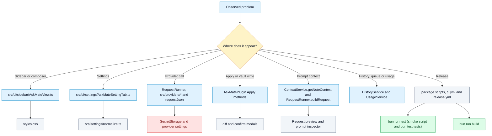

# Debugging Map

## Purpose

Show where developers should look first for common failures, logs, tests, config, and boundary bugs.

## Diagram

```mermaid
flowchart TD
  Symptom["Observed problem"] --> Kind{"Where does it appear?"}
  Kind -- "Sidebar or composer" --> Sidebar["src/ui/sidebar/AskMateView.ts"]
  Kind -- "Settings" --> Settings["src/ui/settings/AskMateSettingTab.ts"]
  Kind -- "Provider call" --> Providers["RequestRunner, src/providers/* and requestJson"]
  Kind -- "Apply or vault write" --> Apply["AskMatePlugin Apply methods"]
  Kind -- "Prompt context" --> Context["ContextService.getNoteContext and RequestRunner.buildRequest"]
  Kind -- "History, queue or usage" --> Services["HistoryService and UsageService"]
  Kind -- "Release" --> Release["package scripts, ci.yml and release.yml"]

  Sidebar --> Styles["styles.css"]
  Settings --> Normalize["src/settings/normalize.ts"]
  Providers --> Secrets["SecretStorage and provider settings"]
  Apply --> Modals["diff and confirm modals"]
  Context --> Preview["Request preview and prompt inspector"]
  Release --> Smoke["bun run test (smoke script and bun test tests)"]
  Release --> Build["bun run build"]

  classDef core fill:#E0F2FE,stroke:#0284C7,color:#0F172A
  classDef decision fill:#FEF3C7,stroke:#D97706,color:#0F172A
  classDef risk fill:#FEE2E2,stroke:#DC2626,color:#7F1D1D
  classDef test fill:#DCFCE7,stroke:#16A34A,color:#14532D
  classDef config fill:#F1F5F9,stroke:#64748B,color:#0F172A

  class Symptom,Sidebar,Settings,Providers,Apply,Context,Services core
  class Kind decision
  class Secrets risk
  class Smoke,Build test
  class Styles,Normalize,Modals,Preview,Release config
```

## Debugging starting points

| Symptom | Start here | Then inspect | Why |
| --- | --- | --- | --- |
| Sidebar cannot send or stop request | `src/ui/sidebar/AskMateView.ts` | `activeRun`, `beginRun`, `stopActiveRun`, `runRequest` | Sidebar owns run state and abort signals. |
| Wrong note context after sidebar focus | `src/context/ContextService.ts` | `getNoteContext`, `rememberActiveMarkdownContext`, `lastMarkdownView`, `lastNoteContext`, `handleFileRenamed`, `handleFileDeleted`; `tests/context-service.test.ts` | Context fallback lives in `ContextService`; the plugin only forwards workspace and vault events. |
| Provider error or missing models | `src/requests/RequestRunner.ts` | `src/providers/index.ts`, provider-specific file, `getProviderApiKey`, `requestJson`; `tests/providers-*.test.ts`, `tests/request-runner.test.ts` | The runner calls the dispatcher, and the runtime mediates provider requests. |
| Reply shows an incomplete warning or Apply refuses to replace | `src/requests/RequestRunner.ts` | Provider `incompleteReason`, `readOpenAIResponseText`, `metadata.outputIncompleteReason`, `assertOutputCompleteForReplace` | The provider reported a token limit, filter or refusal. |
| Reply renders oddly (image shown as a link, code block shown as text) | `src/ui/sidebar/renderSafety.ts` | `sanitizeModelMarkdown`, `PLAIN_CODE_LANGUAGES`; `tests/render-safety.test.ts` | Model output is deliberately neutralised before rendering. |
| Note history, review queue or budget looks wrong | `src/history/HistoryService.ts`, `src/usage/UsageService.ts` | `normalizeReviewQueueItems`, `capReviewQueueItems`, `totalsByDay`; `tests/history-usage.test.ts` | These services own persisted history, queue and usage data. |
| Apply writes wrong place or refuses write | `src/plugin/AskMatePlugin.ts` | `applyResponseToContext`, `appendResponseToCapturedNote`, `applyResponseToHeadingSection` | Apply safety and targeting live in plugin core. |
| Diff or confirmation issue | `src/ui/modals/modals.ts` | `src/shared/markdownDiff.ts`, `confirmTextApplyPreview` | UI confirmation is split from decision logic. |
| Settings value resets or migrates poorly | `src/settings/normalize.ts` | `src/settings/defaults.ts`, `src/settings/syncInPlace.ts`, `src/shared/types.ts`; `tests/settings-migration.test.ts`, `tests/sync-in-place.test.ts` | Normalizers define migration and fallback behaviour; `syncObjectInPlace` keeps the live settings object stable across saves. |
| Smoke guard fails | `scripts/roadmap-smoke-tests.ts` | File named in the failure message | The script checks release metadata, forbidden APIs, safety wiring strings, unused CSS selectors and required README disclosures. |
| Unit test fails | `tests/<area>.test.ts` | The module the test imports | Behaviour tests run under `bun test`; modules that import `obsidian` are loaded with a mocked module. |
| Release failed | `.github/workflows/release.yml` | `package.json`, `manifest.json`, `versions.json` | CI validates versions and minAppVersion, then publishes assets. |

## Notes

Pure logic (prompt building, render safety, settings migration, Apply maths, diffs, image intent, provider adapters with a fake runtime) is covered by the `bun test` suite in `tests/`. For bugs involving real Obsidian UI, live provider APIs, or vault writes, combine the relevant unit test with manual testing in a development vault.

## Traceability

| Field | Details |
| --- | --- |
| Source files inspected | `src/ui/sidebar/AskMateView.ts`, `src/ui/sidebar/renderSafety.ts`, `src/plugin/AskMatePlugin.ts`, `src/context/ContextService.ts`, `src/requests/RequestRunner.ts`, `src/history/HistoryService.ts`, `src/usage/UsageService.ts`, `src/providers/index.ts`, `src/ui/modals/modals.ts`, `src/shared/markdownDiff.ts`, `src/settings/normalize.ts`, `scripts/roadmap-smoke-tests.ts`, `tests/*`, `.github/workflows/release.yml`, `CONTRIBUTING.md` |
| Key symbols | `activeRun`, `AbortController`, `getNoteContext`, `requestJson`, `applyResponseToContext`, `askMateDiffConfirm`, `normalizeProviderSettings`, `sanitizeModelMarkdown`, `check` |
| Inferences | The triage order is inferred from ownership and failure boundaries. |
| Confidence | inferred |
| Open questions | Actual runtime logs and Notices were not exercised. |
