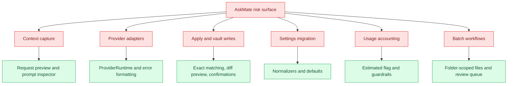

# Risk And Edge Cases

## Purpose

Show risk zones, likely failure modes, edge cases, and mitigations grounded in code and docs.

## Diagram

## Risk table

| Zone | Evidence | Risk | Label | Probe |
| --- | --- | --- | --- | --- |
| Sidebar note context | `getNoteContext`, `lastMarkdownView`, `lastNoteContext` | Focus in the right sidebar can make active Markdown view unavailable, so fallback correctness matters. | inferred | Ask from sidebar while a note is open and inspect request preview. |
| Selected text Apply | `findExactOccurrences`, `applyResponseToContext` | Whitespace changes or duplicate selected text can block Apply for safety. | confirmed | Select duplicated text, ask, then Apply. |
| Full-note Apply | `confirmTruncatedContextFullApply`, `prepareFrontmatterAwareApply` | Truncated context or YAML frontmatter can make replacement risky. | confirmed | Try full-note Apply with Concise budget and frontmatter. |
| Provider adapters | `src/providers/*`, `completeProviderTextRequest` | Each service has different endpoint, response, usage, and error shape. | confirmed | Mock or manually test a failed response per provider. |
| Image planning | `prepareImagePrompt`, `extractPlannedImagePrompt` | Invalid planning output falls back to the original prompt. | confirmed | Force invalid JSON from planning provider. |
| Abort behavior | `AbortController`, `requestJson`, `isAbortError` | Stop button may stop UI state before external HTTP truly ends. | inferred | Stop a slow provider request and observe usage/error record. |
| Review queue | `queueReviewItemFromRequest`, `applyReviewQueueItem` | Source note changes after queueing can make queued write stale. | confirmed | Queue a review item, edit source note, then apply. |
| Batch workflows | `runBatchWorkflow`, folder limits | Large folders or provider failures can produce partial results. | confirmed | Run against a small test folder with one problematic note. |
| Usage accounting | `recordOperationUsage`, `TokenUsageRecord` | Some providers may not return usage, so estimates can affect guardrails. | inferred | Compare estimated and real usage rows. |
| Settings migration | `normalizeAskMateSettings` helpers | Old or malformed settings should be sanitized without losing important intent. | confirmed | Load older settings fixture if available. |

## Notes

Most high-risk areas are not algorithmic complexity. They are boundaries: active editor state, provider network IO, user privacy controls, and vault writes. The strongest mitigation is to preserve request preview, prompt inspector, explicit Apply confirmations, and source-backed smoke assertions.

## Traceability

| Field | Details |
| --- | --- |
| Source files inspected | `src/plugin/AskMatePlugin.ts`, `src/ui/sidebar/AskMateView.ts`, `src/providers/*`, `src/settings/normalize.ts`, `src/shared/types.ts`, `CONTRIBUTING.md`, `SECURITY.md`, `scripts/roadmap-smoke-tests.ts` |
| Key symbols | `getNoteContext`, `applyResponseToContext`, `confirmTruncatedContextFullApply`, `prepareFrontmatterAwareApply`, `completeProviderTextRequest`, `recordOperationUsage`, `runBatchWorkflow`, `ReviewQueueItem` |
| Inferences | Risk severity and probe order are inferred from boundary sensitivity. |
| Confidence | inferred |
| Open questions | Manual Obsidian and provider testing is needed to confirm actual user impact. |
