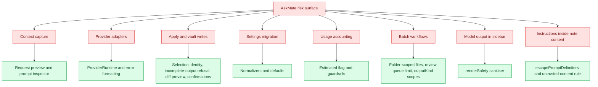

# Risk And Edge Cases

## Purpose

Show risk zones, likely failure modes, edge cases, and mitigations grounded in code and docs.

## Diagram

```mermaid
flowchart TD
  Risks["AskMate risk surface"] --> Context["Context capture"]
  Risks --> Provider["Provider adapters"]
  Risks --> Apply["Apply and vault writes"]
  Risks --> Settings["Settings migration"]
  Risks --> Usage["Usage accounting"]
  Risks --> Batch["Batch workflows"]
  Risks --> Output["Model output in sidebar"]
  Risks --> Injection["Instructions inside note content"]

  Context --> ContextMit["Request preview and prompt inspector"]
  Provider --> ProviderMit["ProviderRuntime and error formatting"]
  Apply --> ApplyMit["Selection identity, incomplete-output refusal, diff preview, confirmations"]
  Settings --> SettingsMit["Normalizers and defaults"]
  Usage --> UsageMit["Estimated flag and guardrails"]
  Batch --> BatchMit["Folder-scoped files, review queue limit, outputKind scopes"]
  Output --> OutputMit["renderSafety sanitiser"]
  Injection --> InjectionMit["escapePromptDelimiters and untrusted-content rule"]

  classDef risk fill:#FEE2E2,stroke:#DC2626,color:#7F1D1D
  classDef core fill:#E0F2FE,stroke:#0284C7,color:#0F172A
  classDef test fill:#DCFCE7,stroke:#16A34A,color:#14532D

  class Risks,Context,Provider,Apply,Settings,Usage,Batch,Output,Injection risk
  class ContextMit,ProviderMit,ApplyMit,SettingsMit,UsageMit,BatchMit,OutputMit,InjectionMit test
```

## Risk table

| Zone | Evidence | Risk | Label | Probe |
| --- | --- | --- | --- | --- |
| Sidebar note context | `ContextService.getNoteContext`, `lastMarkdownView`, `lastNoteContext` | Focus in the right sidebar can make active Markdown view unavailable, so fallback correctness matters. | inferred | Ask from sidebar while a note is open and inspect request preview. |
| Selected text Apply | `resolveSelectionIdentity`, `applyResponseToContext` | Edits that remove the selected text, or leave it repeated without matching anchors, block Apply for safety. | confirmed | Select duplicated text, edit around it, ask, then Apply. |
| Replace-scope Apply | `assertOutputCompleteForReplace`, `confirmReplaceScopeRisks`, `prepareFrontmatterAwareApply` | Incomplete replies, truncated primary context, selection-only context or YAML frontmatter can make replacement risky. | confirmed | Try full-note Apply with Concise budget and frontmatter, and with a reply cut short by a low token limit. |
| Provider adapters | `src/providers/*`, `completeProviderTextRequest` | Each service has different endpoint, response, usage, and error shape. | confirmed | Mock or manually test a failed response per provider. |
| Image planning | `prepareImagePrompt`, `extractPlannedImagePrompt`, `buildFallbackImagePrompt` | Invalid planning output falls back to a direct prompt with a capped excerpt of the primary note. | confirmed | Force invalid JSON from planning provider. |
| Abort behavior | `AbortController`, `requestJson`, `isAbortError` | Stop button may stop UI state before external HTTP truly ends. | inferred | Stop a slow provider request and observe usage/error record. |
| Review queue | `queueReviewItemFromRequest`, `applyReviewQueueItem`, `capReviewQueueItems` | Source note changes after queueing make a queued write stale, so Apply refuses it. Pending items are never evicted, and queueing stops at the pending limit. | confirmed | Queue a review item, edit source note, then apply. |
| Batch workflows | `runBatchWorkflow`, folder limits | Large folders or provider failures can produce partial results. | confirmed | Run against a small test folder with one problematic note. |
| Usage accounting | `recordOperationUsage`, `TokenUsageRecord`, `totalsByDay` | Some providers may not return usage, so estimates can affect guardrails. Failed or stopped calls without reported usage do not count. | inferred | Compare estimated and real usage rows. |
| Model output rendering | `sanitizeModelMarkdown` in `src/ui/sidebar/renderSafety.ts` | A prompt-injected reply could try to load remote resources or trigger plugin code blocks such as `dataviewjs`. The sanitiser is a conservative parser, so unusual Markdown may slip through or be over-neutralised. | confirmed | Ask for a reply containing a remote image, an `iframe` and a `dataviewjs` block. |
| Prompt injection | `escapePromptDelimiters`, untrusted-content rule in `requestBuilders.ts` | Note text can still influence the model; escaping only stops it forging AskMate's own section tags. | inferred | Put instructions and fake `</note_context>` tags in a note and inspect the final prompt. |
| Settings migration | `normalizeAskMateSettings` helpers | Old or malformed settings should be sanitized without losing important intent. | confirmed | Load older settings fixture if available. |

## Notes

Most high-risk areas are not algorithmic complexity. They are boundaries: active editor state, provider network IO, user privacy controls, and vault writes. The strongest mitigation is to preserve request preview, prompt inspector, explicit Apply confirmations, the reply sanitiser, and the `bun test` suite plus the smoke guards.

## Traceability

| Field | Details |
| --- | --- |
| Source files inspected | `src/plugin/AskMatePlugin.ts`, `src/context/ContextService.ts`, `src/requests/*`, `src/ui/sidebar/AskMateView.ts`, `src/ui/sidebar/renderSafety.ts`, `src/providers/*`, `src/settings/normalize.ts`, `src/shared/trustSafety.ts`, `src/shared/types.ts`, `CONTRIBUTING.md`, `SECURITY.md`, `scripts/roadmap-smoke-tests.ts` |
| Key symbols | `getNoteContext`, `applyResponseToContext`, `resolveSelectionIdentity`, `assertOutputCompleteForReplace`, `confirmReplaceScopeRisks`, `prepareFrontmatterAwareApply`, `completeProviderTextRequest`, `recordOperationUsage`, `runBatchWorkflow`, `ReviewQueueItem`, `sanitizeModelMarkdown`, `escapePromptDelimiters` |
| Inferences | Risk severity and probe order are inferred from boundary sensitivity. |
| Confidence | inferred |
| Open questions | Manual Obsidian and provider testing is needed to confirm actual user impact. |
