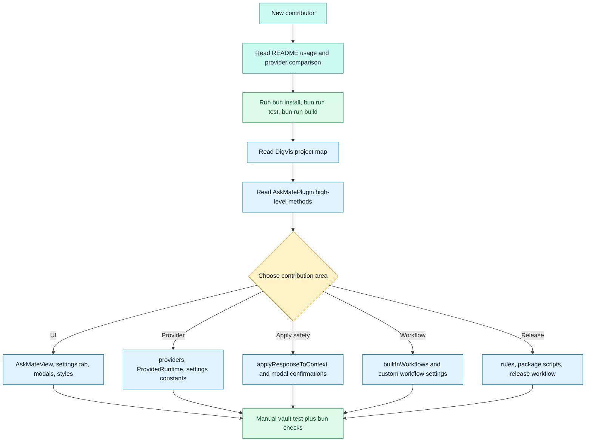

# Onboarding Path

## Purpose

Show beginner and advanced learning paths through the project.

## Diagram

## Beginner path

| Step | Read or run | Outcome |
| --- | --- | --- |
| 1 | `README.md` | Understand user-facing features and providers. |
| 2 | `CONTRIBUTING.md` | Learn development commands and safety rules. |
| 3 | `DigVis/00-project-map.md` | Understand repository shape. |
| 4 | `DigVis/01-architecture-overview.md` | Understand runtime components. |
| 5 | `src/plugin/AskMatePlugin.ts` around `onload`, `getNoteContext`, `buildRequest`, `runOpenAIRequest` | See the main execution path. |
| 6 | `src/ui/sidebar/AskMateView.ts` around `submitQuestion` and `runRequest` | See how the sidebar drives the plugin. |
| 7 | `bun run test` and `bun run build` | Confirm local validation works. |

## Advanced paths

| Goal | Path |
| --- | --- |
| Add or adjust a provider | `src/shared/types.ts`, `src/settings/constants.ts`, `src/settings/defaults.ts`, `src/settings/normalize.ts`, provider adapter, `src/providers/index.ts`, settings UI, README, smoke tests. |
| Change Apply behavior | `applyResponseToContext`, heading and append helpers, frontmatter helper, `src/ui/modals/modals.ts`, `src/shared/markdownDiff.ts`, `CONTRIBUTING.md`, `SECURITY.md`. |
| Add context source | Shared types, defaults, normalizer, settings UI, request preview, `buildContextAttachments`, prompt inspector, privacy docs. |
| Change workflows | `src/workflows/builtInWorkflows.ts`, custom workflow settings in plugin and settings tab, sidebar workflow grid. |
| Debug release | `rules.md`, `package.json`, `manifest.json`, `versions.json`, `.github/workflows/release.yml`. |

## Notes

Start with behavior and boundaries before editing. AskMate has many safety-sensitive paths, so contributors should understand context capture, privacy controls, and Apply targeting before changing UI or provider behavior.

## Traceability

| Field | Details |
| --- | --- |
| Source files inspected | `README.md`, `CONTRIBUTING.md`, `rules.md`, `src/plugin/AskMatePlugin.ts`, `src/ui/sidebar/AskMateView.ts`, `src/ui/settings/AskMateSettingTab.ts`, `src/providers/index.ts`, `src/workflows/builtInWorkflows.ts`, `scripts/roadmap-smoke-tests.ts` |
| Key symbols | `onload`, `getNoteContext`, `buildRequest`, `runOpenAIRequest`, `submitQuestion`, `runRequest`, `WORKFLOWS`, `completeProviderTextRequest` |
| Inferences | Reading paths are inferred from dependency direction and common contribution types. |
| Confidence | inferred |
| Open questions | None. |
