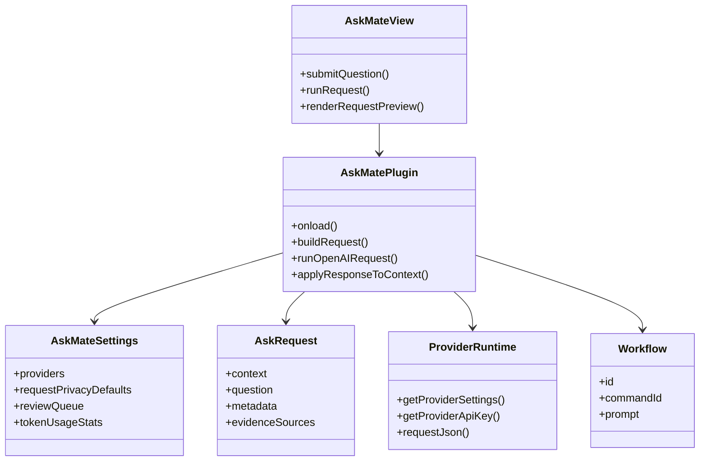

# Glossary

## Purpose

Define project-specific terms, domain concepts, important classes, modules, and commands.

## Diagram

## Glossary table

| Term | Meaning | Evidence |
| --- | --- | --- |
| AskMate | The Obsidian plugin and user-facing AI assistant. | `README.md`, `manifest.json` |
| `AskMatePlugin` | Central plugin class and orchestrator. | `src/plugin/AskMatePlugin.ts` |
| `AskMateView` | Right-sidebar UI item view. | `src/ui/sidebar/AskMateView.ts` |
| `AskMateSettingTab` | Plugin settings UI. | `src/ui/settings/AskMateSettingTab.ts` |
| Provider | Text or image model service used by AskMate. | `src/shared/types.ts`, `src/providers/*` |
| `ProviderRuntime` | Interface provider adapters use for settings, secrets, and HTTP. | `src/providers/types.ts` |
| `AskRequest` | Built request object sent through the model path. | `src/shared/types.ts` |
| `AskRequestMetadata` | Request facts such as intent, model, privacy, context budget, and output mode. | `src/shared/types.ts` |
| `NoteContext` | Current note or selected text plus file and location metadata. | `src/shared/types.ts`, `AskMatePlugin.getNoteContext` |
| Context attachment | Extra prompt context such as thread history, folder notes, style guide, glossary, or image manifest. | `src/shared/types.ts`, `buildContextAttachments` |
| Evidence source | Source snippet attached to a text request for evidence-linked answers. | `src/shared/types.ts`, `buildEvidenceSources` |
| Apply | Write AI output back to the captured note or selection. | `applyResponseToContext`, `CONTRIBUTING.md` |
| Review queue | Deferred Apply path stored in settings and managed from the settings tab. | `ReviewQueueItem`, `queueReviewItemFromRequest` |
| Workflow | Built-in or custom reusable prompt action. | `src/workflows/builtInWorkflows.ts`, `CustomWorkflow` |
| Prompt inspector | UI that shows the final prompt before sending. | `inspectFinalPrompt`, `src/ui/modals/modals.ts` |
| Usage guardrails | Budget and warning controls for token usage. | `AskMateSettings`, `recordOperationUsage` |
| Result note | Generated Markdown note containing model output. | `createTextResultNote`, `createImageResultNote` |
| Image prompt planning | Text-model step that prepares an image prompt before OpenAI image generation. | `prepareImagePrompt`, `ImagePromptPlan` |

## Notes

The glossary terms are drawn from the shared type model and the plugin core. When adding a new persisted concept, update `src/shared/types.ts`, defaults, normalizers, settings UI, and this glossary together.

## Traceability

| Field | Details |
| --- | --- |
| Source files inspected | `src/shared/types.ts`, `src/plugin/AskMatePlugin.ts`, `src/ui/sidebar/AskMateView.ts`, `src/ui/settings/AskMateSettingTab.ts`, `src/providers/types.ts`, `src/workflows/builtInWorkflows.ts`, `README.md` |
| Key symbols | `AskMatePlugin`, `AskMateView`, `AskMateSettings`, `AskRequest`, `AskRequestMetadata`, `NoteContext`, `ContextAttachment`, `ProviderRuntime`, `Workflow`, `ReviewQueueItem` |
| Inferences | Definitions are shortened for maintainers and may omit fields not relevant to architecture. |
| Confidence | confirmed |
| Open questions | None. |
