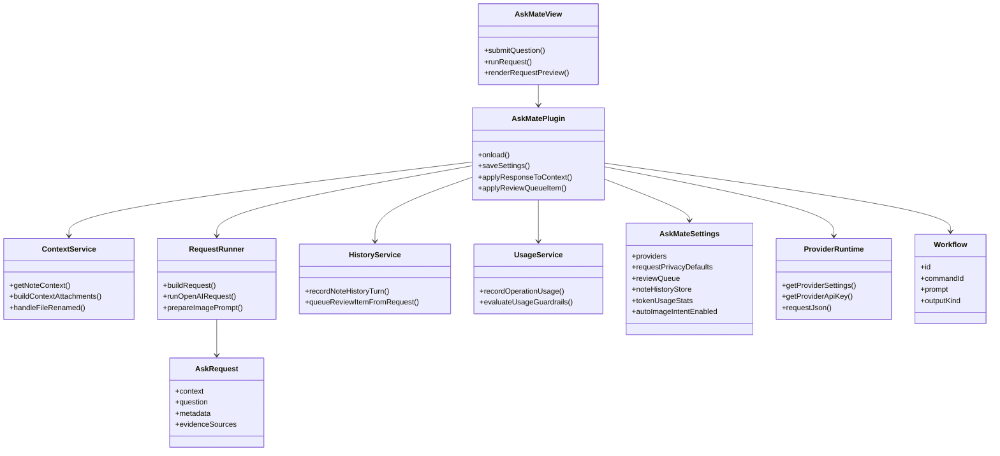

# Glossary

## Purpose

Define project-specific terms, domain concepts, important classes, modules, and commands.

## Diagram

```mermaid
classDiagram
  class AskMatePlugin {
    +onload()
    +saveSettings()
    +applyResponseToContext()
    +applyReviewQueueItem()
  }
  class ContextService {
    +getNoteContext()
    +buildContextAttachments()
    +handleFileRenamed()
  }
  class RequestRunner {
    +buildRequest()
    +runOpenAIRequest()
    +prepareImagePrompt()
  }
  class HistoryService {
    +recordNoteHistoryTurn()
    +queueReviewItemFromRequest()
  }
  class UsageService {
    +recordOperationUsage()
    +evaluateUsageGuardrails()
  }
  class AskMateView {
    +submitQuestion()
    +runRequest()
    +renderRequestPreview()
  }
  class AskMateSettings {
    +providers
    +requestPrivacyDefaults
    +reviewQueue
    +noteHistoryStore
    +tokenUsageStats
    +autoImageIntentEnabled
  }
  class AskRequest {
    +context
    +question
    +metadata
    +evidenceSources
  }
  class ProviderRuntime {
    +getProviderSettings()
    +getProviderApiKey()
    +requestJson()
  }
  class Workflow {
    +id
    +commandId
    +prompt
    +outputKind
  }

  AskMateView --> AskMatePlugin
  AskMatePlugin --> AskMateSettings
  AskMatePlugin --> ContextService
  AskMatePlugin --> RequestRunner
  AskMatePlugin --> HistoryService
  AskMatePlugin --> UsageService
  RequestRunner --> AskRequest
  AskMatePlugin --> ProviderRuntime
  AskMatePlugin --> Workflow
```

## Glossary table

| Term | Meaning | Evidence |
| --- | --- | --- |
| AskMate | The Obsidian plugin and user-facing AI assistant. | `README.md`, `manifest.json` |
| `AskMatePlugin` | Central plugin class and orchestrator; owns Apply and vault writes and wires the services. | `src/plugin/AskMatePlugin.ts` |
| `ContextService` | Captures note context with the sidebar fallbacks and builds context attachments. | `src/context/ContextService.ts` |
| `RequestRunner` | Builds `AskRequest` objects and runs provider text and image calls. | `src/requests/RequestRunner.ts` |
| `HistoryService` | Stores note history turns and review queue items. | `src/history/HistoryService.ts` |
| `UsageService` | Records token usage and evaluates budgets. | `src/usage/UsageService.ts` |
| `AskMateView` | Right-sidebar UI item view. | `src/ui/sidebar/AskMateView.ts` |
| `AskMateSettingTab` | Plugin settings UI. | `src/ui/settings/AskMateSettingTab.ts` |
| Provider | Text or image model service used by AskMate. | `src/shared/types.ts`, `src/providers/*` |
| `ProviderRuntime` | Interface provider adapters use for settings, secrets, and HTTP. | `src/providers/types.ts` |
| `AskRequest` | Built request object sent through the model path. | `src/shared/types.ts` |
| `AskRequestMetadata` | Request facts such as intent, model, privacy, context budget, output mode, `primaryContextTruncated` and `outputIncompleteReason`. | `src/shared/types.ts` |
| `NoteContext` | Current note or selected text plus file and location metadata. | `src/shared/types.ts`, `ContextService.getNoteContext` |
| Context attachment | Extra prompt context such as thread history, folder notes, style guide, glossary, or image manifest. | `src/shared/types.ts`, `ContextService.buildContextAttachments` |
| Evidence source | Source snippet attached to a text request for evidence-linked answers. | `src/shared/types.ts`, `buildEvidenceSources` in `src/requests/requestBuilders.ts` |
| Apply | Write AI output back to the captured note or selection. | `applyResponseToContext`, `CONTRIBUTING.md` |
| `SelectionIdentity` | Captured selection text, offsets and surrounding anchors used to find the selection again at Apply time. | `createSelectionIdentity`, `resolveSelectionIdentity` in `src/shared/trustSafety.ts` |
| Incomplete output | A reply cut short by a token limit, filter or refusal; recorded as `incompleteReason` and blocks replace-scope Apply. | `ProviderTextResult`, `assertOutputCompleteForReplace` |
| Review queue | Deferred Apply path stored in plugin data and managed from the settings tab. Pending items are never evicted by the cap. | `ReviewQueueItem`, `queueReviewItemFromRequest`, `capReviewQueueItems` |
| Note history | Per-note question and answer turns stored in plugin data, optionally sent as context. | `NoteHistoryTurn`, `HistoryService.recordNoteHistoryTurn` |
| Workflow | Built-in or custom reusable prompt action. | `src/workflows/builtInWorkflows.ts`, `CustomWorkflow` |
| Workflow output kind | `note-edit` (a full revised note that may replace it) or `new-content` (appended or saved as a note). | `WorkflowOutputKind`, `Workflow.outputKind` |
| Image intent | Whether a question should generate an image: `/image` or `/img`, or an imperative image request when auto-detection is on. | `shouldGenerateImage` in `src/shared/imageIntent.ts` |
| Render safety | Neutralising remote images, network-loading HTML and plugin code blocks in model replies before rendering. | `sanitizeModelMarkdown` in `src/ui/sidebar/renderSafety.ts` |
| Prompt inspector | UI that shows the final prompt before sending. | `inspectFinalPrompt`, `src/ui/modals/modals.ts` |
| Usage guardrails | Budget and warning controls for token usage, summed from per-day totals. | `AskMateSettings`, `UsageService.evaluateUsageGuardrails`, `totalsByDay` |
| Result note | Generated Markdown note containing model output. | `createResultNote`, `createImageResultNote` |
| Image prompt planning | Text-model step that prepares an image prompt before OpenAI image generation. | `prepareImagePrompt`, `ImagePromptPlan` |

## Notes

The glossary terms are drawn from the shared type model and the plugin core. When adding a new persisted concept, update `src/shared/types.ts`, defaults, normalizers, settings UI, and this glossary together.

## Traceability

| Field | Details |
| --- | --- |
| Source files inspected | `src/shared/types.ts`, `src/plugin/AskMatePlugin.ts`, `src/context/ContextService.ts`, `src/requests/RequestRunner.ts`, `src/requests/requestBuilders.ts`, `src/history/HistoryService.ts`, `src/usage/UsageService.ts`, `src/shared/imageIntent.ts`, `src/shared/trustSafety.ts`, `src/ui/sidebar/AskMateView.ts`, `src/ui/sidebar/renderSafety.ts`, `src/ui/settings/AskMateSettingTab.ts`, `src/providers/types.ts`, `src/workflows/builtInWorkflows.ts`, `README.md` |
| Key symbols | `AskMatePlugin`, `ContextService`, `RequestRunner`, `HistoryService`, `UsageService`, `AskMateView`, `AskMateSettings`, `AskRequest`, `AskRequestMetadata`, `NoteContext`, `ContextAttachment`, `ProviderRuntime`, `Workflow`, `ReviewQueueItem`, `SelectionIdentity` |
| Inferences | Definitions are shortened for maintainers and may omit fields not relevant to architecture. |
| Confidence | confirmed |
| Open questions | None. |
