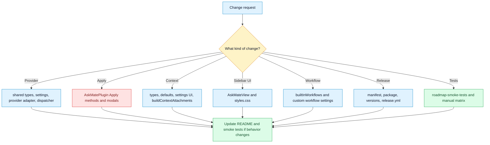

# Where To Change Things

## Purpose

Map common feature requests and maintenance tasks to the files or modules a developer should inspect first.

## Diagram

## Change recipes

| Request | First files to inspect | Validation focus |
| --- | --- | --- |
| Add a text provider | `src/shared/types.ts`, `src/settings/constants.ts`, `src/settings/defaults.ts`, `src/settings/normalize.ts`, `src/providers/new-provider.ts`, `src/providers/index.ts`, `src/ui/settings/AskMateSettingTab.ts` | Provider setup, model refresh, connection test, README, smoke test. |
| Change OpenAI image behavior | `src/plugin/AskMatePlugin.ts`, `src/providers/open-ai.ts`, `src/shared/modelCapabilities.ts`, image templates in settings defaults | Image prompt planning, save, insert, note output. |
| Change Apply behavior | `applyResponseToContext`, `appendResponseToCapturedNote`, `applyResponseToHeadingSection`, `prepareFrontmatterAwareApply`, `src/ui/modals/modals.ts`, `src/shared/markdownDiff.ts` | Selected text safety, full note confirmation, frontmatter, truncated context. |
| Add a context source | `src/shared/types.ts`, `src/settings/defaults.ts`, `src/settings/normalize.ts`, `AskMateSettingTab`, `AskMateView` preview, `buildContextAttachments` | Privacy toggles, prompt inspector, context budget, evidence sources. |
| Change sidebar layout | `src/ui/sidebar/AskMateView.ts`, `styles.css`, `rules.md` | Obsidian CSS review rules, focus, scroll containment. |
| Add built-in workflow | `src/workflows/builtInWorkflows.ts`, commands in `AskMatePlugin.onload`, workflow display settings | Command ID, prompt shape, sidebar display, smoke test. |
| Change usage guardrails | `src/shared/types.ts`, `src/settings/defaults.ts`, `src/settings/normalize.ts`, `recordOperationUsage`, settings UI | Estimated usage, warn or block mode, budget reset. |
| Change release behavior | `manifest.json`, `package.json`, `versions.json`, `.github/workflows/release.yml`, `rules.md` | Version sync, `bun run test`, `bun run build`, release assets. |

## Notes

Most product changes touch at least three layers: shared types, plugin behavior, and UI. If the change affects public behavior, update README and smoke tests. If it affects vault writes, privacy, or provider data, also check `SECURITY.md` and `CONTRIBUTING.md`.

## Traceability

| Field | Details |
| --- | --- |
| Source files inspected | `src/shared/types.ts`, `src/settings/*`, `src/plugin/AskMatePlugin.ts`, `src/ui/sidebar/AskMateView.ts`, `src/ui/settings/AskMateSettingTab.ts`, `src/ui/modals/modals.ts`, `src/providers/*`, `src/workflows/builtInWorkflows.ts`, `README.md`, `CONTRIBUTING.md`, `rules.md`, `.github/workflows/release.yml` |
| Key symbols | `TextProviderId`, `DEFAULT_SETTINGS`, `normalizeProviderSettings`, `completeProviderTextRequest`, `applyResponseToContext`, `WORKFLOWS`, `recordOperationUsage` |
| Inferences | File lists are change recipes, not exhaustive dependency graphs. |
| Confidence | inferred |
| Open questions | Maintainer preference may alter where future changes should live. |
