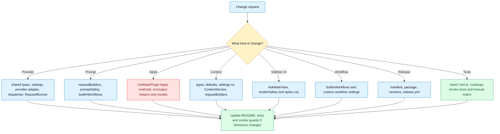

# Where To Change Things

## Purpose

Map common feature requests and maintenance tasks to the files or modules a developer should inspect first.

## Diagram

```mermaid
flowchart TD
  Change["Change request"] --> Kind{"What kind of change?"}
  Kind -- "Provider" --> ProviderFiles["shared types, settings, provider adapter, dispatcher, RequestRunner"]
  Kind -- "Apply" --> ApplyFiles["AskMatePlugin Apply methods, src/output helpers and modals"]
  Kind -- "Context" --> ContextFiles["types, defaults, settings UI, ContextService, requestBuilders"]
  Kind -- "Prompt" --> PromptFiles["requestBuilders, promptSafety, builtInWorkflows"]
  Kind -- "Sidebar UI" --> SidebarFiles["AskMateView, renderSafety and styles.css"]
  Kind -- "Workflow" --> WorkflowFiles["builtInWorkflows and custom workflow settings"]
  Kind -- "Release" --> ReleaseFiles["manifest, package, versions, release.yml"]
  Kind -- "Tests" --> TestFiles["tests/*.test.ts, roadmap-smoke-tests and manual matrix"]

  ProviderFiles --> Validate["Update README, tests and smoke guards if behaviour changes"]
  PromptFiles --> Validate
  ApplyFiles --> Validate
  ContextFiles --> Validate
  SidebarFiles --> Validate
  WorkflowFiles --> Validate
  ReleaseFiles --> Validate
  TestFiles --> Validate

  classDef decision fill:#FEF3C7,stroke:#D97706,color:#0F172A
  classDef core fill:#E0F2FE,stroke:#0284C7,color:#0F172A
  classDef test fill:#DCFCE7,stroke:#16A34A,color:#14532D
  classDef risk fill:#FEE2E2,stroke:#DC2626,color:#7F1D1D

  class Kind decision
  class Change,ProviderFiles,ContextFiles,PromptFiles,SidebarFiles,WorkflowFiles,ReleaseFiles core
  class Validate,TestFiles test
  class ApplyFiles risk
```

## Change recipes

| Request | First files to inspect | Validation focus |
| --- | --- | --- |
| Add a text provider | `src/shared/types.ts`, `src/settings/constants.ts`, `src/settings/defaults.ts`, `src/settings/normalize.ts`, `src/providers/new-provider.ts`, `src/providers/index.ts`, `src/requests/RequestRunner.ts`, `src/ui/settings/AskMateSettingTab.ts` | Provider setup, model refresh, connection test, `incompleteReason` mapping, README, `tests/providers-adapters.test.ts`. |
| Change OpenAI image behavior | `src/requests/RequestRunner.ts`, `src/plugin/AskMatePlugin.ts`, `src/providers/open-ai.ts`, `src/shared/modelCapabilities.ts`, `src/shared/imageIntent.ts`, image templates in settings defaults | Image intent, prompt planning, save, insert, note output, `tests/image-intent.test.ts`, `tests/request-runner.test.ts`. |
| Change Apply behavior | `applyResponseToContext`, `appendResponseToCapturedNote`, `applyResponseToHeadingSection`, `prepareFrontmatterAwareApply`, `assertOutputCompleteForReplace`, `confirmReplaceScopeRisks`, `src/output/*`, `src/shared/trustSafety.ts`, `src/ui/modals/modals.ts`, `src/shared/markdownDiff.ts` | Selected text safety, full note confirmation, frontmatter, truncated context, incomplete output, `tests/apply-*.test.ts`, `tests/plugin-helpers.test.ts`, `tests/trust-safety.test.ts`. |
| Add a context source | `src/shared/types.ts`, `src/settings/defaults.ts`, `src/settings/normalize.ts`, `AskMateSettingTab`, `AskMateView` preview, `ContextService.buildContextAttachments`, `buildPromptContextContent` | Privacy toggles, prompt inspector, context budget, evidence sources, delimiter escaping, `tests/context-service.test.ts`, `tests/request-builders.test.ts`. |
| Change prompt text | `src/requests/requestBuilders.ts`, `src/requests/promptSafety.ts`, `src/workflows/builtInWorkflows.ts` | Outcome-first GPT-5.5 prompt standard, untrusted-content rule, `tests/request-builders.test.ts`, `tests/workflows.test.ts`. |
| Change how replies render | `src/ui/sidebar/renderSafety.ts`, `src/ui/sidebar/AskMateView.ts` | Remote images, network-loading HTML and plugin code blocks stay inert, `tests/render-safety.test.ts`. |
| Change sidebar layout | `src/ui/sidebar/AskMateView.ts`, `styles.css`, `rules.md` | Obsidian CSS review rules, focus, scroll containment, unused selector guard in the smoke script. |
| Add built-in workflow | `src/workflows/builtInWorkflows.ts`, commands in `AskMatePlugin.onload`, workflow display settings | Command ID, prompt shape, `outputKind`, sidebar display, `tests/workflows.test.ts`. |
| Change usage guardrails | `src/shared/types.ts`, `src/settings/defaults.ts`, `src/settings/normalize.ts`, `src/usage/UsageService.ts`, settings UI | Estimated usage, warn or block mode, `totalsByDay`, budget reset, `tests/history-usage.test.ts`. |
| Change note history or review queue | `src/history/HistoryService.ts`, `normalizeReviewQueueItems` and `capReviewQueueItems` in `src/settings/normalize.ts`, `applyReviewQueueItem` | Pending items never evicted, queue limit, rename and delete handling, `tests/history-usage.test.ts`. |
| Add a persisted setting | `src/shared/types.ts`, `src/settings/defaults.ts`, `src/settings/normalize.ts`, `src/settings/syncInPlace.ts` behaviour, settings UI | Migration of old data, `tests/settings-migration.test.ts`, `tests/sync-in-place.test.ts`. |
| Change release behavior | `manifest.json`, `package.json`, `versions.json`, `.github/workflows/release.yml`, `rules.md` | Version sync, `bun run test`, `bun run build`, release assets. |

## Notes

Most product changes touch at least three layers: shared types, a service or the plugin, and UI. If the change affects public behaviour, update README, the relevant `tests/*.test.ts` file and, where a disclosure or wiring guard applies, `scripts/roadmap-smoke-tests.ts`. If it affects vault writes, privacy, or provider data, also check `SECURITY.md` and `CONTRIBUTING.md`.

## Traceability

| Field | Details |
| --- | --- |
| Source files inspected | `src/shared/types.ts`, `src/settings/*`, `src/plugin/AskMatePlugin.ts`, `src/context/*`, `src/requests/*`, `src/history/*`, `src/usage/*`, `src/output/*`, `src/ui/sidebar/AskMateView.ts`, `src/ui/sidebar/renderSafety.ts`, `src/ui/settings/AskMateSettingTab.ts`, `src/ui/modals/modals.ts`, `src/providers/*`, `src/workflows/builtInWorkflows.ts`, `tests/*`, `README.md`, `CONTRIBUTING.md`, `rules.md`, `.github/workflows/release.yml` |
| Key symbols | `TextProviderId`, `DEFAULT_SETTINGS`, `normalizeProviderSettings`, `completeProviderTextRequest`, `applyResponseToContext`, `WORKFLOWS`, `recordOperationUsage` |
| Inferences | File lists are change recipes, not exhaustive dependency graphs. |
| Confidence | inferred |
| Open questions | Maintainer preference may alter where future changes should live. |
