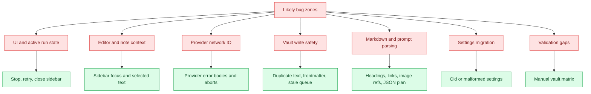

# Where Bugs Hide

## Purpose

Map likely bug zones based on boundaries, async work, state, config, parsing, IO, integrations, and tests.

## Diagram

## Bug zones

| Zone | Why bugs hide there | Source evidence | Suggested check |
| --- | --- | --- | --- |
| Active run state | Stop, retry, clear, workflow toggles, and actions all depend on idle state. | `AskMateView.activeRun`, `beginRun`, `finishRun` | Start, stop, retry, close and reopen sidebar. |
| Sidebar note context | Obsidian active view may not be a Markdown view when sidebar has focus. | `getNoteContext`, workspace listeners, contributor rule | Ask from sidebar with no selected text. |
| Provider response parsing | Providers expose different response structures and usage formats. | `src/providers/*`, `ProviderTextResult` | Test failed, empty, and usage-free responses. |
| Image prompt planning | Planning expects structured output but has fallback behavior. | `prepareImagePrompt`, `extractPlannedImagePrompt` | Feed invalid JSON from planning model. |
| Selected text Apply | Safe replacement requires current selection or exactly one occurrence. | `findExactOccurrences`, `applyResponseToContext` | Duplicate selected text and whitespace variants. |
| Heading Apply | Heading parsing can miss unsupported Markdown heading styles. | `applyResponseToHeadingSection`, heading helpers | Test nested ATX and Setext headings. |
| Frontmatter handling | YAML preservation, confirmation, and replacement branch by policy. | `prepareFrontmatterAwareApply` | Full-note Apply with malformed frontmatter. |
| Review queue | Deferred writes can become stale if source note changes. | `ReviewQueueItem`, `applyReviewQueueItem` | Edit source after queueing. |
| Batch processing | Multiple files and external provider calls create partial success states. | `runBatchWorkflow` | Run against mixed valid and invalid notes. |
| Settings migration | Many persisted settings require normalization and limits. | `normalize.ts`, `DEFAULT_SETTINGS` | Load old settings fixture. |

## Notes

The most important bugs are likely to appear at boundaries where the plugin crosses from UI state to Obsidian editor state, from local prompt construction to external HTTP, or from AI output to vault mutation.

## Traceability

| Field | Details |
| --- | --- |
| Source files inspected | `src/ui/sidebar/AskMateView.ts`, `src/plugin/AskMatePlugin.ts`, `src/providers/*`, `src/settings/normalize.ts`, `src/shared/types.ts`, `CONTRIBUTING.md`, `SECURITY.md`, `scripts/roadmap-smoke-tests.ts` |
| Key symbols | `activeRun`, `getNoteContext`, `ProviderTextResult`, `extractPlannedImagePrompt`, `findExactOccurrences`, `prepareFrontmatterAwareApply`, `applyReviewQueueItem`, `runBatchWorkflow` |
| Inferences | Bug likelihood is inferred from complexity and boundary sensitivity, not from issue history. |
| Confidence | inferred |
| Open questions | Real user issue data was not inspected. |
