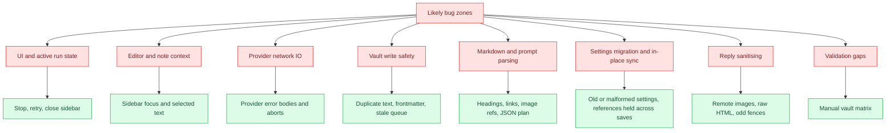

# Where Bugs Hide

## Purpose

Map likely bug zones based on boundaries, async work, state, config, parsing, IO, integrations, and tests.

## Diagram

```mermaid
flowchart TD
  Bugs["Likely bug zones"] --> State["UI and active run state"]
  Bugs --> Context["Editor and note context"]
  Bugs --> Network["Provider network IO"]
  Bugs --> Writes["Vault write safety"]
  Bugs --> Parsing["Markdown and prompt parsing"]
  Bugs --> Config["Settings migration and in-place sync"]
  Bugs --> Rendering["Reply sanitising"]
  Bugs --> Coverage["Validation gaps"]

  State --> StateProbe["Stop, retry, close sidebar"]
  Context --> ContextProbe["Sidebar focus and selected text"]
  Network --> NetworkProbe["Provider error bodies and aborts"]
  Writes --> WriteProbe["Duplicate text, frontmatter, stale queue"]
  Parsing --> ParsingProbe["Headings, links, image refs, JSON plan"]
  Config --> ConfigProbe["Old or malformed settings, references held across saves"]
  Rendering --> RenderingProbe["Remote images, raw HTML, odd fences"]
  Coverage --> CoverageProbe["Manual vault matrix"]

  classDef risk fill:#FEE2E2,stroke:#DC2626,color:#7F1D1D
  classDef test fill:#DCFCE7,stroke:#16A34A,color:#14532D

  class Bugs,State,Context,Network,Writes,Parsing,Config,Rendering,Coverage risk
  class StateProbe,ContextProbe,NetworkProbe,WriteProbe,ParsingProbe,ConfigProbe,RenderingProbe,CoverageProbe test
```

## Bug zones

| Zone | Why bugs hide there | Source evidence | Suggested check |
| --- | --- | --- | --- |
| Active run state | Stop, retry, clear, workflow toggles, and actions all depend on idle state. | `AskMateView.activeRun`, `beginRun`, `finishRun` | Start, stop, retry, close and reopen sidebar. |
| Sidebar note context | Obsidian active view may not be a Markdown view when sidebar has focus. | `ContextService.getNoteContext`, workspace listeners, contributor rule | Ask from sidebar with no selected text. |
| Provider response parsing | Providers expose different response structures, stop reasons and usage formats. | `src/providers/*`, `ProviderTextResult.incompleteReason`, `readOpenAIResponseText` | Test failed, empty, truncated, refused and usage-free responses. |
| Image prompt planning | Planning expects structured output but has fallback behavior. | `prepareImagePrompt`, `extractPlannedImagePrompt` | Feed invalid JSON from planning model. |
| Selected text Apply | Safe replacement needs the captured offsets to still match, or a single anchored or unique occurrence. | `resolveSelectionIdentity`, `applyResponseToContext` | Duplicate selected text, nearby edits and whitespace variants. |
| Heading Apply | Heading parsing can miss unsupported Markdown heading styles; `#` lines in code fences and frontmatter are ignored. | `applyResponseToHeadingSection`, `parseMarkdownHeadingSections`, `spliceHeadingSectionBody` | Test nested ATX and Setext headings, and fenced `#` lines. |
| Frontmatter handling | YAML preservation, confirmation, and replacement branch by policy. | `prepareFrontmatterAwareApply` | Full-note Apply with malformed frontmatter. |
| Review queue | Deferred writes can become stale if source note changes; apply and dismiss must update the live queue by id after every await. | `ReviewQueueItem`, `applyReviewQueueItem`, `HistoryService` | Edit source after queueing; apply one item while another is dismissed. |
| Batch processing | Multiple files and external provider calls create partial success states; incomplete results count as failures. | `runBatchWorkflow`, `outputKind` | Run against mixed valid and invalid notes. |
| Settings migration | Many persisted settings require normalization and limits; arrays are replaced on each save, so held array references go stale. | `normalize.ts`, `DEFAULT_SETTINGS`, `syncObjectInPlace` | Load old settings fixture; save while a request is running. |
| Reply sanitising | `renderSafety` is a hand-written Markdown scanner, so unusual fences, inline HTML or nested constructs may be missed or over-neutralised. | `sanitizeModelMarkdown`, `tests/render-safety.test.ts` | Render replies with nested fences, HTML comments and reference images. |

## Notes

The most important bugs are likely to appear at boundaries where the plugin crosses from UI state to Obsidian editor state, from local prompt construction to external HTTP, or from AI output to vault mutation.

## Traceability

| Field | Details |
| --- | --- |
| Source files inspected | `src/ui/sidebar/AskMateView.ts`, `src/ui/sidebar/renderSafety.ts`, `src/plugin/AskMatePlugin.ts`, `src/context/ContextService.ts`, `src/requests/RequestRunner.ts`, `src/history/HistoryService.ts`, `src/providers/*`, `src/settings/normalize.ts`, `src/settings/syncInPlace.ts`, `src/shared/trustSafety.ts`, `src/shared/types.ts`, `CONTRIBUTING.md`, `SECURITY.md`, `scripts/roadmap-smoke-tests.ts` |
| Key symbols | `activeRun`, `getNoteContext`, `ProviderTextResult`, `extractPlannedImagePrompt`, `resolveSelectionIdentity`, `prepareFrontmatterAwareApply`, `applyReviewQueueItem`, `runBatchWorkflow`, `syncObjectInPlace`, `sanitizeModelMarkdown` |
| Inferences | Bug likelihood is inferred from complexity and boundary sensitivity, not from issue history. |
| Confidence | inferred |
| Open questions | Real user issue data was not inspected. |
