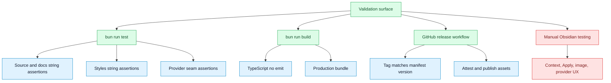

# Test Coverage Map

## Purpose

Map observed validation coverage to modules and flows, and show gaps that need manual validation or future tests.

## Diagram

## Observed automated coverage

| Check | Command or file | Covers | Confidence |
| --- | --- | --- | --- |
| Smoke tests | `bun run test`, `scripts/roadmap-smoke-tests.ts` | Roadmap seams, provider runtime interface, Apply safety names, context builders, styles, README promises. | confirmed |
| TypeScript check | `bun run build` through `tsc -noEmit -skipLibCheck` | Type compatibility for included TypeScript files. | confirmed |
| Production bundle | `bun run build` through `esbuild.config.mjs production` | Bundles `main.ts` to `main.js`. | confirmed |
| Release workflow | `.github/workflows/release.yml` | Version match, tests, build, asset attestation, release upload. | confirmed |

## Gaps and manual matrix

| Flow | Automated coverage observed | Manual or future test needed |
| --- | --- | --- |
| Sidebar focus context fallback | String assertions and contributor docs mention it. | Manual Obsidian test with sidebar focused. |
| Provider success and failure | Adapter files asserted to use `ProviderRuntime`. | Mock or live provider response tests. |
| OpenAI image generation | README and source assertions mention image model and templates. | Manual test saving, inserting, and result note output. |
| Apply selected text | Safety methods asserted by smoke tests. | Duplicate text, stale selection, and whitespace tests. |
| Apply heading and full note | Safety methods and approval mode strings asserted. | Heading parsing, frontmatter, truncated budget tests. |
| Review queue | Source and style strings asserted. | Stale source and settings UI apply or dismiss tests. |
| Batch workflow | Source and style strings asserted. | Partial success, failed file, review queue output tests. |
| Usage guardrails | Source and styles asserted. | Warn mode, block mode, estimated usage tests. |

## Notes

The visible automated test suite is a roadmap smoke script based on file content assertions. This is useful for protecting seams and public promises, but it does not replace behavioral tests against Obsidian APIs, provider mocks, or vault writes.

## Traceability

| Field | Details |
| --- | --- |
| Source files inspected | `package.json`, `scripts/roadmap-smoke-tests.ts`, `.github/workflows/release.yml`, `CONTRIBUTING.md`, `rules.md`, `tsconfig.json`, `esbuild.config.mjs` |
| Key symbols | `assertIncludes`, `assertPattern`, `assertNotPattern`, `bun run test`, `bun run build`, `release.yml` |
| Inferences | Absence of unit or integration tests is inferred from inspected tree and package scripts, not a guarantee that none exist elsewhere. |
| Confidence | confirmed |
| Open questions | No tests were run while drafting this file. Final task validation records whether docs and project checks were executed. |
