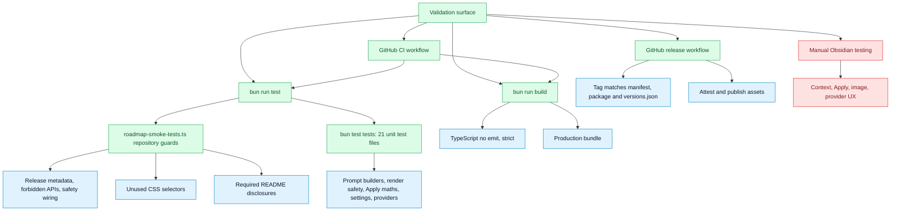

# Test Coverage Map

## Purpose

Map observed validation coverage to modules and flows, and show gaps that need manual validation or future tests.

## Diagram

```mermaid
flowchart TD
  Validation["Validation surface"] --> Smoke["bun run test"]
  Validation --> Build["bun run build"]
  Validation --> CI["GitHub CI workflow"]
  Validation --> Release["GitHub release workflow"]
  Validation --> Manual["Manual Obsidian testing"]

  Smoke --> Guards["roadmap-smoke-tests.ts repository guards"]
  Smoke --> Unit["bun test tests: 21 unit test files"]
  Guards --> SourceStrings["Release metadata, forbidden APIs, safety wiring"]
  Guards --> Styles["Unused CSS selectors"]
  Guards --> ReadmeDocs["Required README disclosures"]
  Unit --> PureLogic["Prompt builders, render safety, Apply maths, settings, providers"]
  Build --> TSC["TypeScript no emit, strict"]
  Build --> Esbuild["Production bundle"]
  CI --> Smoke
  CI --> Build
  Release --> Version["Tag matches manifest, package and versions.json"]
  Release --> Assets["Attest and publish assets"]
  Manual --> Vault["Context, Apply, image, provider UX"]

  classDef test fill:#DCFCE7,stroke:#16A34A,color:#14532D
  classDef core fill:#E0F2FE,stroke:#0284C7,color:#0F172A
  classDef config fill:#F1F5F9,stroke:#64748B,color:#0F172A
  classDef risk fill:#FEE2E2,stroke:#DC2626,color:#7F1D1D

  class Validation,Smoke,Build,CI,Release,Guards,Unit test
  class SourceStrings,Styles,ReadmeDocs,PureLogic,TSC,Esbuild,Version,Assets core
  class Manual,Vault risk
```

## Observed automated coverage

| Check | Command or file | Covers | Confidence |
| --- | --- | --- | --- |
| Repository guards | `bun run test`, `scripts/roadmap-smoke-tests.ts` | Version agreement across `manifest.json`, `package.json` and `versions.json`; no empty `fundingUrl`; forbidden APIs (`innerHTML`, `eval`, `fetch`, `console.log`, clipboard, vault-wide enumeration); safety wiring strings in plugin, view and builders; unused CSS selectors; required README disclosures. | confirmed |
| Unit tests | `bun run test` then `bun test tests` (21 files; 394 tests passed on 2026-10-01) | Pure logic and services listed in the table below. Modules that import `obsidian` are loaded with `mock.module`. | confirmed |
| TypeScript check | `bun run build` through `tsc -noEmit -skipLibCheck` | Type compatibility with `strict`, `noUnusedLocals` and `noUnusedParameters`. `tests/` is excluded from `tsc`. | confirmed |
| Production bundle | `bun run build` through `esbuild.config.mjs production` | Bundles `main.ts` to `main.js`. | confirmed |
| CI workflow | `.github/workflows/ci.yml` | `bun install --frozen-lockfile`, `bun run test`, `bun run build` on Bun 1.4.2. | confirmed |
| Release workflow | `.github/workflows/release.yml` | Version triad check, tests, build, asset attestation, release upload. | confirmed |

## Unit test files

| Test file | Covers |
| --- | --- |
| `tests/apply-and-abort.test.ts` | Abort errors, Apply scope resolution, append helper. |
| `tests/apply-math.test.ts` | Heading section parsing and frontmatter splitting. |
| `tests/context-service.test.ts` | Sidebar context rule, recency, rename and delete, attachment truncation, Excalidraw text. |
| `tests/history-usage.test.ts` | Review queue limits and `HistoryService`, `UsageService` budgets from per-day totals. |
| `tests/image-intent.test.ts` | `/image` and `/img` commands and imperative image request detection. |
| `tests/markdown-diff.test.ts` | Diff lines, omitted-line rows and diff stats. |
| `tests/output-paths.test.ts` | File name and path template sanitising, unique paths. |
| `tests/plugin-helpers.test.ts` | Result backlink insertion, heading section splice, note text comparison, workflow preferences. |
| `tests/providers.test.ts`, `tests/providers-adapters.test.ts`, `tests/providers-openai.test.ts` | Provider routing, timeouts, request bodies, response and stop-reason parsing, model refresh, OpenAI `store: false`. |
| `tests/render-safety.test.ts` | Reply sanitiser: remote and reference images, raw HTML, code spans, vault embeds, code-block processors. |
| `tests/request-builders.test.ts` | Delimiter escaping, prompt-injection rule, primary-first context budget, image privacy, evidence, output mode prompts. |
| `tests/request-runner.test.ts` | OpenAI and other provider text requests, incomplete output, image requests and planning fallback, `buildRequest`. |
| `tests/settings-migration.test.ts`, `tests/settings-normalize.test.ts` | Legacy and corrupt settings, collection normalisers, base URL policy. |
| `tests/settings-tab-helpers.test.ts` | Integer and base URL input handling for the settings tab. |
| `tests/sync-in-place.test.ts` | `syncObjectInPlace` keeps nested settings objects stable. |
| `tests/templates.test.ts` | Template rendering keeps reply content exactly. |
| `tests/trust-safety.test.ts` | Abort and timeout, preview change detection, run identity, retry snapshots, selection identity resolution. |
| `tests/workflows.test.ts` | Built-in workflow definitions, including `outputKind`. |

## Gaps and manual matrix

| Flow | Automated coverage observed | Manual or future test needed |
| --- | --- | --- |
| Sidebar focus context fallback | `ContextService` unit tests with a mocked workspace. | Manual Obsidian test with sidebar focused. |
| Provider success and failure | Adapter and runner tests with a fake `ProviderRuntime`. | Live provider checks before adapter changes. |
| OpenAI image generation | Runner tests for planning, fallback and response checks. | Manual test saving, inserting, and result note output. |
| Apply selected text | `resolveSelectionIdentity` unit tests; wiring guard in the smoke script. | End-to-end Apply in a vault, since `AskMatePlugin` is not loaded in bun. |
| Apply heading and full note | Heading, frontmatter and splice helper tests; wiring guards for `confirmReplaceScopeRisks` and `outputIncompleteReason`. | Diff modal and frontmatter policy flows in a vault. |
| Review queue | `HistoryService` and normaliser tests for limits and pending items. | Settings UI apply or dismiss, stale source note. |
| Batch workflow | Not unit tested (lives in `AskMatePlugin`). | Partial success, failed file, review queue output scopes. |
| Usage guardrails | `UsageService` budget tests from per-day totals. | Warn and block prompts in the UI. |
| Reply rendering | Sanitiser unit tests; wiring guard that the view renders through `sanitizeModelMarkdown`. | Visual check in Obsidian with Mermaid and maths. |

## Notes

`bun run test` runs two layers: the repository guard script, which checks metadata, forbidden APIs, wiring strings, CSS and README content, and the `bun test` suite in `tests/`, which tests pure modules and services directly. `AskMatePlugin.ts` and `AskMateView.ts` import the Obsidian runtime and are not loaded in tests, so Apply, batch and UI flows still need manual testing in a development vault.

## Traceability

| Field | Details |
| --- | --- |
| Source files inspected | `package.json`, `scripts/roadmap-smoke-tests.ts`, `tests/*.test.ts`, `.github/workflows/ci.yml`, `.github/workflows/release.yml`, `CONTRIBUTING.md`, `rules.md`, `tsconfig.json`, `esbuild.config.mjs` |
| Key symbols | `check`, `mock.module`, `bun run test`, `bun test tests`, `bun run build`, `ci.yml`, `release.yml` |
| Inferences | The gap column is inferred from which modules import the Obsidian runtime and therefore are not loaded under `bun test`. |
| Confidence | confirmed |
| Open questions | The test count changes as tests are added; rerun `bun test tests` for the current number. |
