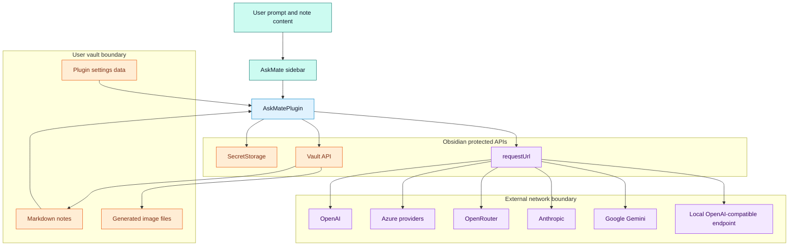

# Trust Boundaries

## Purpose

Show security-relevant trust boundaries, user input, secrets, file access, network calls, external services, and permission checks.

## Diagram

## What can cross boundaries

| Boundary | Data that may cross | Controls and safeguards |
| --- | --- | --- |
| Vault to prompt | Current note, selected text, attachments, image references if enabled. | Request privacy defaults, request preview, prompt inspector, context budget, image reference omission. |
| Settings to runtime | Provider choices, model IDs, context limits, output and Apply settings. | Defaults and normalizers. |
| Secret storage to provider call | API key retrieved by secret name. | Raw keys are retrieved from `SecretStorage`, not stored directly in settings. |
| Plugin to external provider | Prompt instructions, note context, attachments, workflow prompt, model request. | User provider configuration and privacy controls. |
| Provider output to vault | Text output, generated PNG, result notes, Apply writes. | Output mode, Apply scope, diff preview, confirmations, exact matching, frontmatter policy. |
| CI to release users | `main.js`, `manifest.json`, `styles.css`. | Version check, tests, build, asset attestation. |

## Apply safety boundaries

| Safety gate | Evidence | Behavior |
| --- | --- | --- |
| Captured-file targeting | `request.context.file`, `getOpenMarkdownViewForFile` | Writes aim at the captured note rather than an arbitrary active note. |
| Exact selected text matching | `findExactOccurrences` | Selected text Apply requires current selection or exactly one occurrence. |
| Full-note confirmation | `confirmTextApplyPreview` | Full-note replacement requires confirmation even when diff preview is disabled. |
| Truncated-context confirmation | `confirmTruncatedContextFullApply` | Full-note Apply warns when the model did not receive the whole note. |
| Frontmatter policy | `prepareFrontmatterAwareApply` | Preserve, confirm, or replace YAML frontmatter based on settings. |
| Review queue | `queueReviewItemFromRequest`, `applyReviewQueueItem` | Defers writes for later review from settings. |

## Notes

The most privacy-sensitive operation is sending note-derived context to external providers. The most integrity-sensitive operation is writing provider output back to the vault. Both paths are visible in the sidebar through preview or action controls and are backed by explicit source-level safety checks.

## Traceability

| Field | Details |
| --- | --- |
| Source files inspected | `SECURITY.md`, `CONTRIBUTING.md`, `src/plugin/AskMatePlugin.ts`, `src/ui/sidebar/AskMateView.ts`, `src/ui/modals/modals.ts`, `src/providers/types.ts`, `src/providers/index.ts`, `src/shared/types.ts`, `.github/workflows/release.yml` |
| Key symbols | `RequestPrivacyOptions`, `getProviderApiKey`, `app.secretStorage.getSecret`, `requestJson`, `buildPromptContextContent`, `applyResponseToContext`, `confirmTruncatedContextFullApply`, `prepareFrontmatterAwareApply` |
| Inferences | GitHub Actions is shown as a release trust boundary because it produces public assets, not because it runs inside the plugin. |
| Confidence | confirmed |
| Open questions | Live provider privacy policies are outside repository scope and were not reviewed. |
