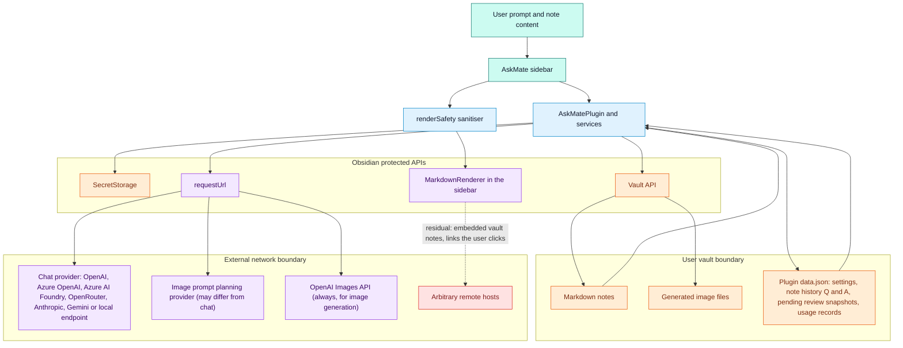

# Trust Boundaries

## Purpose

Show security-relevant trust boundaries, user input, secrets, file access, network calls, external services, and permission checks.

## Diagram

```mermaid
flowchart TD
  User["User prompt and note content"] --> Sidebar["AskMate sidebar"]
  Sidebar --> Plugin["AskMatePlugin and services"]

  subgraph "User vault boundary"
    Notes["Markdown notes"]
    Images["Generated image files"]
    SettingsStore["Plugin data.json: settings, note history Q and A, pending review snapshots, usage records"]
  end

  subgraph "Obsidian protected APIs"
    SecretStorage["SecretStorage"]
    VaultAPI["Vault API"]
    RequestUrl["requestUrl"]
    Renderer["MarkdownRenderer in the sidebar"]
  end

  subgraph "External network boundary"
    ChatProvider["Chat provider: OpenAI, Azure OpenAI, Azure AI Foundry, OpenRouter, Anthropic, Gemini or local endpoint"]
    PlanningProvider["Image prompt planning provider (may differ from chat)"]
    OpenAIImages["OpenAI Images API (always, for image generation)"]
    RemoteHosts["Arbitrary remote hosts"]
  end

  Notes --> Plugin
  SettingsStore --> Plugin
  Plugin --> SettingsStore
  Plugin --> SecretStorage
  Plugin --> VaultAPI
  Plugin --> RequestUrl
  VaultAPI --> Notes
  VaultAPI --> Images
  RequestUrl --> ChatProvider
  RequestUrl --> PlanningProvider
  RequestUrl --> OpenAIImages
  Sidebar --> Sanitiser["renderSafety sanitiser"]
  Sanitiser --> Renderer
  Renderer -.->|"residual: embedded vault notes, links the user clicks"| RemoteHosts

  classDef user fill:#CCFBF1,stroke:#0F766E,color:#0F172A
  classDef core fill:#E0F2FE,stroke:#0284C7,color:#0F172A
  classDef store fill:#FFEDD5,stroke:#EA580C,color:#7C2D12
  classDef external fill:#F3E8FF,stroke:#9333EA,color:#3B0764
  classDef risk fill:#FEE2E2,stroke:#DC2626,color:#7F1D1D

  class User,Sidebar user
  class Plugin,Sanitiser core
  class Notes,Images,SettingsStore,SecretStorage,VaultAPI store
  class RequestUrl,Renderer,ChatProvider,PlanningProvider,OpenAIImages external
  class RemoteHosts risk
```

## What can cross boundaries

| Boundary | Data that may cross | Controls and safeguards |
| --- | --- | --- |
| Vault to prompt | Current note, selected text, attachments, image references if enabled, note history if enabled. | Request privacy defaults, request preview, prompt inspector, context budget, image reference omission; note path and title are withheld when note context is excluded. These are user-facing controls, not enforcement: anything included is sent. |
| Note content inside the prompt | Instructions or fake tags written in notes, attachments, evidence or history. | `escapePromptDelimiters()` stops content forging AskMate's own section tags, and the prompt says that content is untrusted data. This is hardening only; the model can still be influenced. |
| Settings to runtime | Provider choices, model IDs, base URLs, context limits, output and Apply settings. | Defaults and normalizers; `validateProviderBaseUrl()` rejects `http://` for non-loopback, non-private hosts. |
| Secret storage to provider call | API key retrieved by secret name. | Raw keys are retrieved from `SecretStorage`, not stored in settings; unknown keys, including old plain-text keys, are dropped on save; provider errors redact keys. |
| Plugin to chat provider | Prompt instructions, note context, attachments, workflow prompt, model request. Test and model refresh calls send only the API key (Azure tests send a minimal prompt). | User provider configuration and privacy controls. OpenAI Responses requests send `store: false`; other providers' retention is outside AskMate's control. |
| Plugin to image providers | Image prompt planning input (note-derived) to the planning provider; the planned or fallback prompt to the OpenAI Images API. | Image generation always goes to OpenAI, whichever chat provider is selected; README discloses this. The fallback prompt is capped to an excerpt of the primary note. |
| Plugin to data.json | Note history question and answer text (on by default), pending review queue `beforeText` and `proposedText`, usage records with note paths and titles. | History can be turned off or cleared per note; reviewed queue items keep only metadata; history and queue follow renames and are removed on delete. data.json is plain JSON and syncs with `.obsidian`. |
| Provider output to sidebar | Model reply Markdown rendered with `MarkdownRenderer`. | `sanitizeModelMarkdown()` turns remote images into links, escapes network-loading HTML tags, and relabels fences for plugin code-block processors (for example `dataviewjs`). Context image previews load only vault files and `data:image/` URIs. |
| Provider output to vault | Text output, generated PNG, result notes, Apply writes. | Output mode, Apply scope, diff preview, confirmations, selection identity, incomplete-output refusal, frontmatter policy. |
| CI to release users | `main.js`, `manifest.json`, `styles.css`. | Actions pinned to commit SHAs, version check, tests, build, asset attestation. |

## Apply safety boundaries

| Safety gate | Evidence | Behavior |
| --- | --- | --- |
| Captured-file targeting | `request.context.file`, `getOpenMarkdownViewForFile` | Writes aim at the captured note rather than an arbitrary active note. |
| Selection identity | `createSelectionIdentity`, `resolveSelectionIdentity` | Selected text Apply uses the captured offsets when text and anchors still match, otherwise a single anchored or unique occurrence; missing or ambiguous text is refused. |
| Full-note confirmation | `confirmTextApplyPreview` | Full-note replacement requires confirmation even when diff preview is disabled. |
| Incomplete-output refusal | `assertOutputCompleteForReplace`, `HistoryService.queueReviewItemFromRequest` | Replace scopes (selection, heading section, full note) are refused when the reply was cut short, filtered or refused, and such a reply cannot be queued for review except as an append. Append is still allowed. |
| Replace-scope risk confirmation | `confirmReplaceScopeRisks` | Replace scopes ask for confirmation when the primary note or selection was truncated, or when a selection-only reply would replace a whole note or heading section. |
| Edit-during-preview check | `assertNoteUnchangedDuringPreview` | Apply refuses to write if the note changed while the preview was open. |
| Frontmatter policy | `prepareFrontmatterAwareApply` | Preserve, confirm, or replace YAML frontmatter based on settings. |
| Review queue | `queueReviewItemFromRequest`, `applyReviewQueueItem` | Defers writes for later review from settings; refuses stale items whose source note changed. |

## Residual risks

| Risk | Why the controls do not fully cover it | Confidence |
| --- | --- | --- |
| Prompt injection through note content | Delimiter escaping and an instruction are the only defences; a steered reply is still shown and can be applied. | inferred |
| Auto approve Apply mode | `auto-approve` skips selected-text, append and heading-section previews, so a steered reply can be appended without a diff. Full-note replacement still asks. | confirmed |
| Embedded vault notes in replies | The sanitiser leaves `![[...]]` vault embeds alone, so a reply can embed a vault note whose own remote images or HTML then render. | needs verification |
| Sanitiser coverage | `renderSafety` is a conservative hand-written scanner; unusual Markdown may evade it. | inferred |
| Plain-text plugin data | `data.json` holds note history answers and pending review snapshots in plain JSON and is copied by any sync of `.obsidian`. | confirmed |

## Notes

The most privacy-sensitive operations are sending note-derived context to external providers (the chat provider, the image prompt planning provider, and OpenAI Images for every image request) and keeping question and answer history in `data.json`. The most integrity-sensitive operation is writing provider output back to the vault. The request preview and prompt inspector show what will be sent, and Apply goes through the gates above, but privacy controls are choices the user makes rather than enforcement, and the rendering and prompt-injection controls reduce rather than remove risk (see Residual risks). Unit tests cover the pure parts of these controls (`tests/render-safety.test.ts`, `tests/request-builders.test.ts`, `tests/trust-safety.test.ts`, `tests/settings-migration.test.ts` for the base URL policy); the Obsidian glue is covered only by wiring guards in `scripts/roadmap-smoke-tests.ts` and manual testing.

## Traceability

| Field | Details |
| --- | --- |
| Source files inspected | `SECURITY.md`, `CONTRIBUTING.md`, `README.md`, `src/plugin/AskMatePlugin.ts`, `src/requests/RequestRunner.ts`, `src/requests/requestBuilders.ts`, `src/requests/promptSafety.ts`, `src/history/HistoryService.ts`, `src/ui/sidebar/AskMateView.ts`, `src/ui/sidebar/renderSafety.ts`, `src/ui/modals/modals.ts`, `src/providers/types.ts`, `src/providers/index.ts`, `src/providers/open-ai.ts`, `src/providers/common.ts`, `src/settings/normalize.ts`, `src/shared/trustSafety.ts`, `src/shared/types.ts`, `.github/workflows/release.yml` |
| Key symbols | `RequestPrivacyOptions`, `getProviderApiKey`, `app.secretStorage.getSecret`, `requestJson`, `validateProviderBaseUrl`, `redactSecrets`, `buildPromptContextContent`, `escapePromptDelimiters`, `sanitizeModelMarkdown`, `classifyImagePreviewSource`, `requestOpenAIImageGeneration`, `applyResponseToContext`, `assertOutputCompleteForReplace`, `confirmReplaceScopeRisks`, `resolveSelectionIdentity`, `prepareFrontmatterAwareApply` |
| Inferences | GitHub Actions is shown as a release trust boundary because it produces public assets, not because it runs inside the plugin. Rows in the Residual risks table carry their own confidence. |
| Confidence | confirmed |
| Open questions | Live provider privacy policies are outside repository scope and were not reviewed. Whether embedded vault notes in a reply can load remote resources has not been tested in Obsidian. |
