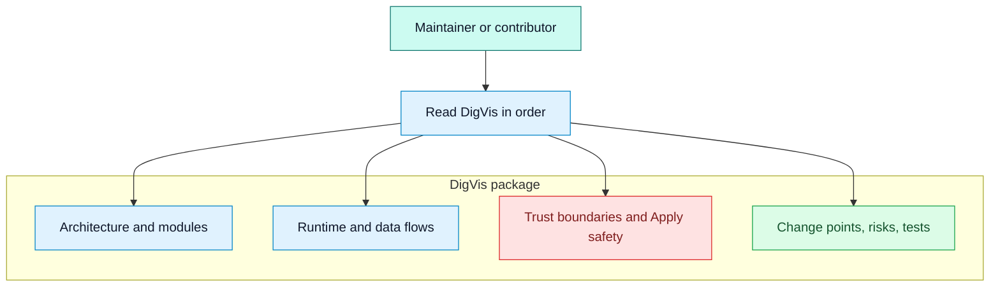

# AskMate DigVis

## Purpose

This DigVis package gives a visual, source-backed map of the AskMate Obsidian plugin. It is for maintainers who need to understand architecture, runtime flows, data movement, safety boundaries, testing, and likely change points before editing code.

## Project summary

AskMate is a desktop-only Obsidian plugin that adds a right-sidebar AI assistant for the current note or selection. It supports Q&A, summaries, rewrites, reusable workflows, safe Apply back into notes, result notes, review queues, usage guardrails, evidence-linked answers, and OpenAI image generation.

## What this package covers

## Notes

Use this index first, then follow the numbered documents. Files marked inferred are still grounded in source inspection, but they include architectural judgment or risk prioritization that should be checked during real changes.

## Recommended reading order

1. [00 Project Map](00-project-map.md)
2. [01 Architecture Overview](01-architecture-overview.md)
3. [02 Module Breakdown](02-module-breakdown.md)
4. [03 Request Or Control Flow](03-request-or-control-flow.md)
5. [04 Data Flow](04-data-flow.md)
6. [05 Dependency Map](05-dependency-map.md)
7. [06 Decision Trees](06-decision-trees.md)
8. [14 Trust Boundaries](14-trust-boundaries.md)
9. [08 Risk And Edge Cases](08-risk-and-edge-cases.md)
10. [12 Where Bugs Hide](12-where-bugs-hide.md)
11. [11 Where To Change Things](11-where-to-change-things.md)
12. [13 Test Coverage Map](13-test-coverage-map.md)
13. [09 Onboarding Path](09-onboarding-path.md)
14. [10 Glossary](10-glossary.md)
15. [07 Debugging Map](07-debugging-map.md)

## Diagram index

| File | What it explains | Confidence |
| --- | --- | --- |
| [00-project-map.md](00-project-map.md) | Top-level repository responsibilities | confirmed |
| [01-architecture-overview.md](01-architecture-overview.md) | Runtime components and boundaries | confirmed |
| [02-module-breakdown.md](02-module-breakdown.md) | Module responsibilities and important files | confirmed |
| [03-request-or-control-flow.md](03-request-or-control-flow.md) | Sidebar, workflow, image, Apply, queue, and batch flows | confirmed |
| [04-data-flow.md](04-data-flow.md) | Note context, prompt context, persistence, and outputs | confirmed |
| [05-dependency-map.md](05-dependency-map.md) | Internal and external dependencies | confirmed |
| [06-decision-trees.md](06-decision-trees.md) | Request, provider, privacy, Apply, and budget branching | confirmed |
| [07-debugging-map.md](07-debugging-map.md) | Common failure triage paths | inferred |
| [08-risk-and-edge-cases.md](08-risk-and-edge-cases.md) | Risk zones and mitigations | inferred |
| [09-onboarding-path.md](09-onboarding-path.md) | Beginner and advanced learning paths | inferred |
| [10-glossary.md](10-glossary.md) | Key domain terms and symbols | confirmed |
| [11-where-to-change-things.md](11-where-to-change-things.md) | Common change requests and starting files | inferred |
| [12-where-bugs-hide.md](12-where-bugs-hide.md) | Likely bug zones by boundary | inferred |
| [13-test-coverage-map.md](13-test-coverage-map.md) | Observed tests, build checks, and gaps | confirmed |
| [14-trust-boundaries.md](14-trust-boundaries.md) | Privacy, secrets, external IO, and vault writes | confirmed |

## Confidence legend

| Level | Meaning |
| --- | --- |
| confirmed | Directly observed in source, docs, config, tests, or release workflow. |
| inferred | Reasoned from direct evidence, but not explicitly documented as design intent. |
| needs verification | A useful claim or risk that requires manual testing or maintainer confirmation. |

## How to update the diagrams

1. Inspect changed source files first.
2. Update the affected DigVis Markdown file.
3. Update `DigVis/manifest.yml` so its file list, source files, confidence, and open questions match the docs.
4. Run the DigVis validation checklist below.
5. If product behavior changed, also run the project validation commands from `CONTRIBUTING.md`: `bun run test` and `bun run build`.

## Validation checklist

- Every Mermaid code block starts with a valid diagram header such as `flowchart`, `sequenceDiagram`, or `classDiagram`.
- Markdown links inside `DigVis/` point to existing files or valid anchors.
- `DigVis/manifest.yml` lists every Markdown file in this folder and no missing files.
- Each diagram file has a title, purpose, Mermaid diagram, notes, traceability, and source references.
- Generated Markdown and YAML files contain no em dash characters.
- Fenced code blocks use language tags.
- Confidence values are only `confirmed`, `inferred`, or `needs verification`.
- If Mermaid CLI is available as `mmdc`, render the diagrams before publishing the package.

## Validation status

The package was generated from repository inspection on 2026-05-19. Keep validation notes in this section when the package is updated. Mermaid rendering should be attempted only if the Mermaid CLI is already available or can be run through permitted project tooling.

## Known gaps and open questions

| Gap | Status |
| --- | --- |
| No unit or integration test suite was visible in the inspected files. | inferred |
| Manual Obsidian behavior, such as actual sidebar focus fallback and Apply UX, was not executed during documentation generation. | needs verification |
| Provider API behavior depends on external services and was not called while creating DigVis. | needs verification |
| Some CSS conclusions are based on targeted slices and source references, not a rendered UI review. | inferred |

## Traceability

| Field | Details |
| --- | --- |
| Source files inspected | `README.md`, `CONTRIBUTING.md`, `SECURITY.md`, `rules.md`, `package.json`, `manifest.json`, `src/plugin/AskMatePlugin.ts`, `src/ui/sidebar/AskMateView.ts`, `src/ui/settings/AskMateSettingTab.ts`, `src/providers/index.ts`, `src/shared/types.ts`, `scripts/roadmap-smoke-tests.ts`, `.github/workflows/release.yml` |
| Key symbols | `AskMatePlugin`, `AskMateView`, `AskMateSettingTab`, `AskRequest`, `AskMateSettings`, `ProviderRuntime`, `WORKFLOWS` |
| Inferences | Reading paths and risk ordering are inferred from ownership and runtime boundaries. |
| Confidence | confirmed |
| Open questions | Manual Obsidian runtime behavior and external provider behavior were not executed. |
