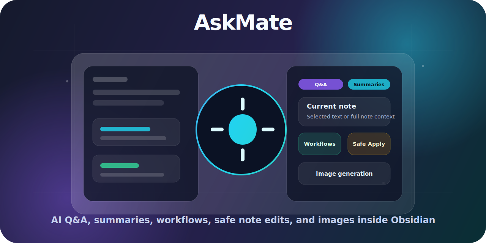

<a id="top"></a>

<p align="center">
  
</p>

<h1 align="center">AskMate</h1>

<p align="center">
  <strong>AI Q&A, summaries, rewrites, workflows, safe note edits, and image generation inside Obsidian.</strong>
</p>

<p align="center">
  <a href="https://github.com/CodeWithBehnam/askmate/releases"></a>
  <a href="https://github.com/CodeWithBehnam/askmate/actions/workflows/release.yml"></a>
  <a href="LICENSE"></a>
  <a href="https://obsidian.md"></a>
  <a href="https://github.com/CodeWithBehnam/askmate/stargazers"></a>
  <a href="https://github.com/CodeWithBehnam/askmate/issues"></a>
</p>

<p align="center">
  
  
  
  
  
  
  
</p>

## Table of Contents

- [About The Project](#about-the-project)
  - [Built With](#built-with)
  - [Use Cases](#use-cases)
  - [Provider Comparison](#provider-comparison)
- [Getting Started](#getting-started)
  - [Requirements](#requirements)
  - [Installation](#installation)
  - [Quick Setup](#quick-setup)
- [Usage](#usage)
  - [Example Prompts](#example-prompts)
  - [Ask About A Note](#ask-about-a-note)
  - [Create Or Apply Output](#create-or-apply-output)
  - [Generate Images](#generate-images)
  - [Run Workflows](#run-workflows)
- [Privacy And Network Use](#privacy-and-network-use)
- [FAQ](#faq)
- [Roadmap](#roadmap)
- [Troubleshooting](#troubleshooting)
- [Development](#development)
- [Contributing And Support](#contributing-and-support)
- [Acknowledgements](#acknowledgements)
- [License](#license)

## About The Project

AskMate is a desktop-only Obsidian plugin that adds a right-sidebar AI assistant for the note you are reading or editing.

Use it to ask questions, summarize, rewrite, translate, run reusable workflows, generate images, and safely write AI output back into your vault.

### Built With

<p>
  <a href="https://obsidian.md"></a>
  <a href="https://www.typescriptlang.org"></a>
  <a href="https://bun.sh"></a>
  <a href="https://esbuild.github.io"></a>
  <a href="https://openai.com"></a>
  <a href="https://www.anthropic.com"></a>
  <a href="https://ai.google.dev/gemini-api"></a>
  <a href="https://openrouter.ai"></a>
</p>

### Use Cases

| Use case | How AskMate helps |
| --- | --- |
| Students | Turn lecture notes into summaries, flashcards, study questions, and action items. |
| Researchers | Extract claims, compare ideas, map evidence, and find gaps across note context. |
| Writers | Rewrite rough notes, polish tone, translate drafts, and preserve structure. |
| Product managers | Convert meetings and research notes into decisions, risks, next steps, and briefs. |
| Developers | Explain technical notes, draft documentation, generate diagrams, and review plans. |
| Knowledge workers | Ask targeted questions, organize scattered notes, and safely apply updates back to the vault. |

### Provider Comparison

| Provider | Text support | Image support | API key needed | Notes |
| --- | --- | --- | --- | --- |
| OpenAI | Yes | Yes, through `gpt-image-2` | Yes | Best fit when you want GPT-5.5 text plus image generation in one provider. |
| Azure OpenAI | Yes | No | Yes | Use an Azure OpenAI `/openai/v1` base URL and enter your Azure deployment name as the model. |
| OpenRouter | Yes | No | Yes | Use OpenRouter model IDs and route text requests through an OpenAI-compatible API. |
| Anthropic Claude | Yes | No | Yes | Good for text workflows, critique, summarization, and long-form analysis. |
| Google Gemini | Yes | No | Yes | Good for text workflows with Gemini models through Google's API. |
| Local endpoint | Yes | No | Optional | Works with OpenAI-compatible `/chat/completions` endpoints such as local or self-hosted models. |

<p align="right">(<a href="#top">back to top</a>)</p>

## Getting Started

### Requirements

- Obsidian `1.11.4` or newer.
- Desktop Obsidian.
- An API key for your selected provider, unless your local endpoint does not require one.
- OpenAI API access for image generation with `gpt-image-2`.

### Installation

#### From Obsidian Community Plugins

After AskMate is available in Obsidian Community Plugins:

1. Open Obsidian Settings.
2. Go to Community plugins.
3. Browse community plugins.
4. Search for `AskMate`.
5. Install and enable the plugin.

#### Manual Installation

1. Download these files from the latest GitHub release:

```text
main.js
manifest.json
styles.css
```

2. Create this folder in your vault:

```text
YourVault/.obsidian/plugins/askmate/
```

3. Copy the three release files into that folder.
4. Restart Obsidian or reload plugins.
5. Enable AskMate from Community plugins.

### Quick Setup

1. Open AskMate settings in Obsidian.
2. Choose a chat provider: OpenAI, Azure OpenAI, OpenRouter, Anthropic Claude, Google Gemini, or Local/self-hosted.
3. Add or select the provider API key secret.
4. For Azure OpenAI, set the v1 base URL, for example `https://<resource>.openai.azure.com/openai/v1`, and enter your Azure deployment name as the model. For local endpoints, set the OpenAI-compatible base URL.
5. Click `Test API`.
6. Click `Refresh models`, or enter a model ID manually.
7. Choose your default text model.
8. Optional: configure image prompt planning and add an OpenAI key for `gpt-image-2`.
9. Optional: configure workflows, output templates, context budgets, send shortcut, usage budgets, and privacy defaults.

<p align="right">(<a href="#top">back to top</a>)</p>

## Usage

### Example Prompts

Copy and paste any of these into AskMate:

```text
Summarize this note into action items.
```

```text
Rewrite this in a clearer tone.
```

```text
Find gaps or contradictions.
```

```text
Create a Mermaid diagram from this note.
```

### Ask About A Note

1. Open a Markdown note.
2. Select text if you want to focus the question on a specific passage.
3. Open AskMate from the ribbon or command palette.
4. Ask a question, for example:

```text
What are the main claims in this note?
```

AskMate answers in the sidebar. By default, previous sidebar messages are shown for convenience but are not sent as chat history unless threaded chat is enabled.

### Create Or Apply Output

Choose an output mode before sending:

- `Chat`: show the answer in the sidebar.
- `New note`: create a Markdown result note.
- `Apply`: write generated text back into the captured source note after safety checks.

Apply mode can preview diffs, preserve or confirm frontmatter changes, replace selected text, replace a heading section, or queue a suggested change for later review.

### Generate Images

Use the Image button or start a request with `/image` or `/img`.

```text
/image Create a clean editorial illustration that captures the core idea of this note.
```

AskMate can save generated PNG files, create image result notes, or insert Obsidian image embeds depending on the selected output mode.

### Run Workflows

AskMate includes workflows for summaries, action plans, simple explanations, question drills, critiques, pros and cons, meeting notes, decision briefs, translation, quote extraction, rewriting, and more.

You can also create custom workflows in settings. Custom workflows can use variables such as:

```text
{{noteTitle}}
{{sourcePath}}
{{contextSource}}
{{selectedText}}
{{currentDate}}
{{currentDateTime}}
{{customInstructions}}
```

<p align="right">(<a href="#top">back to top</a>)</p>

## Privacy And Network Use

> [!IMPORTANT]
> Privacy-first defaults:
>
> - No telemetry.
> - Sends data only when you run a request.
> - API keys are stored through Obsidian `SecretStorage`.
> - Prompt inspector is local and does not contact a provider by itself.

AskMate sends data only when you run a request. Depending on your settings and request, that data can include your prompt, selected text, the current note, workflow instructions, opted-in extra context, image prompt planning content, or generated image prompts.

Image generation is sent to OpenAI because AskMate uses `gpt-image-2` for images. Text requests are sent to the provider you choose.

The prompt inspector is local. It lets you review the final prompt before sending and does not contact a provider by itself.

Provider API keys are stored through Obsidian `SecretStorage`. AskMate stores selected secret names, not raw keys. Generated notes, generated images, usage records, and plugin settings are stored locally in your vault or Obsidian plugin data.

Provider requests are subject to the selected provider's API terms and privacy policy.

<p align="right">(<a href="#top">back to top</a>)</p>

## FAQ

### Does AskMate send my whole vault?

No. AskMate sends only the context included for the request you run. By default, that means selected text or the current or remembered Markdown note. Extra notes, folders, style guides, glossaries, image metadata, and note history are included only when you enable those context sources.

### Can I use local models?

Yes. Choose the Local/self-hosted provider and set an OpenAI-compatible `/chat/completions` base URL. Local endpoints can be used for text chat and workflows. Image generation still uses OpenAI `gpt-image-2`.

### Can I use Azure OpenAI?

Yes. Choose Azure OpenAI, set the v1 base URL such as `https://<resource>.openai.azure.com/openai/v1`, add an API key secret, and enter your Azure deployment name as the model. Azure OpenAI is text-only in Phase 1. Image generation still uses OpenAI `gpt-image-2`.

### Does image generation require OpenAI?

Yes. AskMate image generation uses OpenAI `gpt-image-2`, so it requires an OpenAI API key with access to that image model. Azure OpenAI, OpenRouter, Anthropic Claude, Gemini, and local providers can be used only for text chat and image prompt planning. Azure AI Foundry support is planned for a later phase.

### Can I apply changes safely?

Yes. Apply mode targets the note captured when the request was built, can preview Markdown diffs before writing, asks for confirmation before full-note replacement, supports frontmatter controls, and can queue suggested changes for review instead of applying them immediately.

<p align="right">(<a href="#top">back to top</a>)</p>

## Roadmap

AskMate's current roadmap and status surfaces focus on making note work safer, clearer, and easier to review:

- Evidence-linked answers for source-grounded replies and jump-to-source actions.
- Markdown diff Apply preview for safer note edits before writing changes.
- Frontmatter controls for preserving, confirming, or replacing YAML during full-note Apply.
- Batch workflow runner support for running workflows across folders.
- Final prompt inspector tooling for reviewing the assembled prompt before sending.
- Note-specific AskMate history for per-note follow-up context.
- Style guide and glossary context roles for persistent writing and terminology guidance.
- Queue for review mode for AI-suggested changes that should be checked before applying.
- Smart result-note placement for keeping generated notes near their source notes.
- Usage budgets and guardrails for warning or blocking oversized or over-budget requests.
- Broader provider support: Azure OpenAI for text chat in Phase 1, with Azure AI Foundry planned for a later phase.

<p align="right">(<a href="#top">back to top</a>)</p>

## Troubleshooting

### AskMate used the wrong note

AskMate remembers the most recent Markdown note because the sidebar can take focus. If the preview points to the wrong note, click back into the intended note or select the exact text, then ask again.

### Apply cannot find selected text

AskMate only applies selected-text output when it can safely find the original selected text. Select the text again and use Apply from the assistant response.

### My model is not listed

Click `Refresh models` after adding or changing an API key. If the provider does not list the model you need, enter the model ID manually.

### Image generation fails

`gpt-image-2` may require OpenAI API access and organization verification. Check your OpenAI dashboard, then try again.

<p align="right">(<a href="#top">back to top</a>)</p>

## Development

Install dependencies:

```bash
bun install
```

Run smoke tests:

```bash
bun run test
```

Build:

```bash
bun run build
```

Watch during development:

```bash
bun run dev
```

Release assets are:

```text
main.js
manifest.json
styles.css
```

<p align="right">(<a href="#top">back to top</a>)</p>

## Contributing And Support

- Read `CONTRIBUTING.md` before opening a pull request.
- Use the issue templates for bug reports and feature requests.
- Report security concerns through `SECURITY.md`, not public issues.

## Acknowledgements

AskMate is built on the work of these tools, APIs, and communities:

- [Obsidian](https://obsidian.md) and the Obsidian plugin API.
- [OpenAI](https://openai.com) for GPT-5.5 text support and `gpt-image-2` image generation.
- [Azure OpenAI](https://azure.microsoft.com/products/ai-services/openai-service), [OpenRouter](https://openrouter.ai), [Anthropic](https://www.anthropic.com), and [Google Gemini](https://ai.google.dev/gemini-api) for provider options.
- [Bun](https://bun.sh), [TypeScript](https://www.typescriptlang.org), and [esbuild](https://esbuild.github.io) for the development toolchain.
- [Shields.io](https://shields.io) for README badges.

<p align="right">(<a href="#top">back to top</a>)</p>

## License

AskMate is released under the MIT License. See `LICENSE`.

<p align="right">(<a href="#top">back to top</a>)</p>
