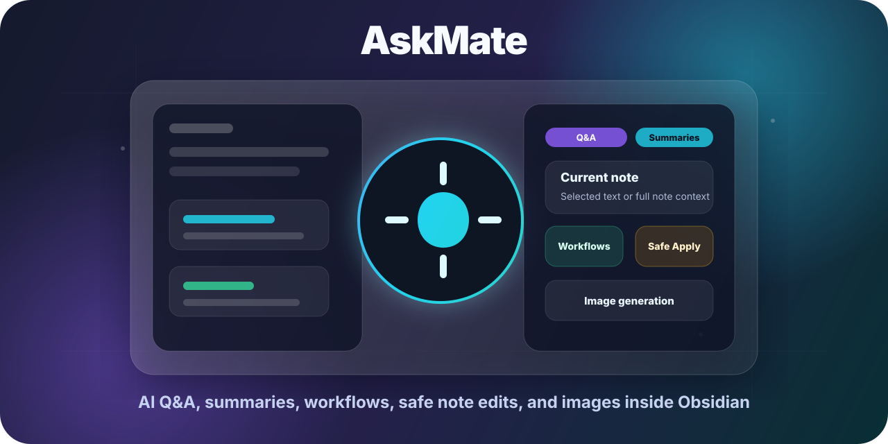

<a id="top"></a>

<p align="center">
  
</p>

<h1 align="center">AskMate</h1>

<p align="center">
  <strong>AI Q&A, summaries, rewrites, workflows, safe note edits, and image generation inside Obsidian.</strong>
</p>

<p align="center">
  <a href="https://github.com/CodeWithBehnam/askmate/releases"></a>
  <a href="https://github.com/CodeWithBehnam/askmate/actions/workflows/release.yml"></a>
  <a href="LICENSE"></a>
  <a href="https://obsidian.md"></a>
  <a href="https://github.com/CodeWithBehnam/askmate/stargazers"></a>
  <a href="https://github.com/CodeWithBehnam/askmate/issues"></a>
</p>

<p align="center">
  
  
  
  
  
  
  
</p>

## Table of Contents

- [About The Project](#about-the-project)
  - [Built With](#built-with)
  - [Use Cases](#use-cases)
  - [Provider Comparison](#provider-comparison)
- [Getting Started](#getting-started)
  - [Requirements](#requirements)
  - [Installation](#installation)
  - [Quick Setup](#quick-setup)
- [Usage](#usage)
  - [Example Prompts](#example-prompts)
  - [Ask About A Note](#ask-about-a-note)
  - [Create Or Apply Output](#create-or-apply-output)
  - [Generate Images](#generate-images)
  - [Run Workflows](#run-workflows)
  - [Console Layout](#console-layout)
- [Privacy And Network Use](#privacy-and-network-use)
- [FAQ](#faq)
- [Roadmap](#roadmap)
- [Troubleshooting](#troubleshooting)
- [Development](#development)
- [Contributing And Support](#contributing-and-support)
- [Acknowledgements](#acknowledgements)
- [License](#license)

## About The Project

AskMate is a desktop-only Obsidian plugin that adds a right-sidebar AI assistant for the note you are reading or editing.

Use it to ask questions, summarize, rewrite, translate, run reusable workflows, generate images, and safely write AI output back into your vault.

### Built With

<p>
  <a href="https://obsidian.md"></a>
  <a href="https://www.typescriptlang.org"></a>
  <a href="https://bun.sh"></a>
  <a href="https://esbuild.github.io"></a>
  <a href="https://openai.com"></a>
  <a href="https://www.anthropic.com"></a>
  <a href="https://ai.google.dev/gemini-api"></a>
  <a href="https://openrouter.ai"></a>
</p>

### Use Cases

| Use case | How AskMate helps |
| --- | --- |
| Students | Turn lecture notes into summaries, flashcards, study questions, and action items. |
| Researchers | Extract claims, compare ideas, map evidence, and find gaps across note context. |
| Writers | Rewrite rough notes, polish tone, translate drafts, and preserve structure. |
| Product managers | Convert meetings and research notes into decisions, risks, next steps, and briefs. |
| Developers | Explain technical notes, draft documentation, generate diagrams, and review plans. |
| Knowledge workers | Ask targeted questions, organize scattered notes, and safely apply updates back to the vault. |

### Provider Comparison

| Provider | Text support | Image support | API key needed | Notes |
| --- | --- | --- | --- | --- |
| OpenAI | Yes | Yes, through `gpt-image-2` | Yes | Best fit when you want GPT-5.5 text plus image generation in one provider. |
| Azure OpenAI | Yes | No | Yes | Use an Azure OpenAI `/openai/v1` base URL and type your Azure deployment name as the model. Deployments cannot be listed with an API key, so there is no model refresh. |
| Azure AI Foundry | Yes | No | Yes | Use an Azure AI inference endpoint such as `https://<resource>.services.ai.azure.com/models` and enter the model or deployment name used by your Foundry resource. |
| OpenRouter | Yes | No | Yes | Use OpenRouter model IDs and route text requests through an OpenAI-compatible API. |
| Anthropic Claude | Yes | No | Yes | Good for text workflows, critique, summarization, and long-form analysis. The default model is `claude-sonnet-5-5`; `claude-opus-5-5` and `claude-haiku-4-5-20251001` are also offered. Saved retired Claude 3 and 3.5 model IDs are switched to the default automatically. |
| Google Gemini | Yes | No | Yes | Good for text workflows with Gemini models through Google's API. |
| Local or self-hosted | Yes | No | Optional | Works with OpenAI-compatible endpoints such as local or self-hosted models. Set the base URL, for example `http://localhost:11434/v1`; AskMate adds `/chat/completions` itself. |

<p align="right">(<a href="#top">back to top</a>)</p>

## Getting Started

### Requirements

- Obsidian `1.13.0` or newer. Older Obsidian versions are offered AskMate 1.8.2, the last release that supports them.
- Desktop Obsidian.
- An API key for your selected provider, unless your local endpoint does not require one.
- OpenAI API access for image generation with `gpt-image-2`.

AskMate is marked desktop-only because it has been designed and tested for desktop Obsidian: the right-sidebar assistant, wide diff and review dialogs, and keyboard send shortcuts. It does not use Node.js or Electron APIs, but it has not been tested on Obsidian mobile yet.

#### Accounts And Costs

AskMate itself is free and has no AskMate account. It calls third-party AI services with your own credentials:

- Every hosted provider (OpenAI, Azure OpenAI, Azure AI Foundry, OpenRouter, Anthropic Claude and Google Gemini) needs an account with that provider and an API key. These providers charge for API usage, usually per token, under their own pricing.
- Image generation always needs a paid OpenAI API account with access to `gpt-image-2`, whichever chat provider you use. OpenAI may also require organisation verification for that model.
- Only a local or self-hosted endpoint that you run yourself works without a paid provider account.

AskMate's usage budgets can warn or block oversized requests, but your provider's billing dashboard is the authority on what you are charged.

### Installation

#### From Obsidian Community Plugins

After AskMate is available in Obsidian Community Plugins:

1. Open Obsidian Settings.
2. Go to Community plugins.
3. Browse community plugins.
4. Search for `AskMate`.
5. Install and enable the plugin.

#### Manual Installation

1. Download these files from the latest GitHub release:

```text
main.js
manifest.json
styles.css
```

2. Create this folder in your vault:

```text
YourVault/.obsidian/plugins/askmate/
```

3. Copy the three release files into that folder.
4. Restart Obsidian or reload plugins.
5. Enable AskMate from Community plugins.

### Quick Setup

1. Open AskMate settings in Obsidian.
2. Choose a chat provider: OpenAI, Azure OpenAI, Azure AI Foundry, OpenRouter, Anthropic Claude, Google Gemini, or Local or self-hosted.
3. Add or select the provider API key secret.
4. For Azure OpenAI, set the v1 base URL, for example `https://<resource>.openai.azure.com/openai/v1`, and type your Azure deployment name as the model. For Azure AI Foundry, set the inference endpoint, for example `https://<resource>.services.ai.azure.com/models`, and enter the model or deployment name. For local endpoints, set the OpenAI-compatible base URL, for example `http://localhost:11434/v1`. Remote base URLs must use `https://`; plain `http://` is accepted only for localhost and private network addresses (`127.0.0.0/8`, `::1`, `10.0.0.0/8`, `172.16.0.0/12`, `192.168.0.0/16` and `*.local`).
5. Click `Test API`. For Azure OpenAI and Azure AI Foundry this sends a minimal text request that may use a few tokens.
6. Click `Refresh models`, or enter a model ID manually. Azure OpenAI has no model refresh, because deployments cannot be listed with an API key.
7. Choose your default text model.
8. Optional: configure image prompt planning and add an OpenAI key for `gpt-image-2`.
9. Optional: configure workflows, output templates, context budgets, send shortcut, usage budgets, and privacy defaults.

<p align="right">(<a href="#top">back to top</a>)</p>

## Usage

### Example Prompts

Copy and paste any of these into AskMate:

```text
Summarize this note into action items.
```

```text
Rewrite this in a clearer tone.
```

```text
Find gaps or contradictions.
```

```text
Create a Mermaid diagram from this note.
```

### Ask About A Note

1. Open a Markdown note.
2. Select text if you want to focus the question on a specific passage.
3. Open AskMate from the ribbon or command palette.
4. Ask a question, for example:

```text
What are the main claims in this note?
```

AskMate answers in the sidebar. By default, previous sidebar messages are shown for convenience but are not sent as chat history unless threaded chat is enabled.

### Create Or Apply Output

Choose an output mode before sending:

- `Chat`: show the answer in the sidebar.
- `New note`: create a Markdown result note.
- `Apply`: write generated text back into the captured source note after safety checks.

Apply mode can preview diffs, preserve or confirm frontmatter changes, replace selected text, append generated output to the captured note when no text was selected, replace a heading section, explicitly replace the full note, or queue a suggested change for later review.

Use the Apply approval mode setting to choose how much confirmation AskMate asks for before text writes:

- `Auto approve`: skips selected-text, append, and heading-section diff previews, but still confirms full-note replacement and keeps hard safety checks.
- `Full`: asks with a diff for full-note and heading-section replacements, but skips selected-text and append previews.
- `Manual`: asks with a diff before every text Apply write.

If a reply is incomplete (it hit the token limit, or the provider filtered or refused it), AskMate shows a warning on the message and refuses to use it to replace note text. Appending it still works. When the note or selection was cut short by the context budget, AskMate asks for confirmation before any replacement.

Queue for review keeps every pending suggestion until you apply or dismiss it; the `Review queue max items` limit never drops pending items. When pending items reach that limit, AskMate refuses to queue more until you review some. Applied and dismissed items keep only metadata, such as the note path, title and question, not the note text. Queued items and note history follow a note when you rename it and are removed when you delete it.

### Generate Images

Use the Image button or start a request with `/image` or `/img`.

```text
/image Create a clean editorial illustration that captures the core idea of this note.
```

AskMate can save generated PNG files, create image result notes, or insert Obsidian image embeds depending on the selected output mode.

With `Detect image requests automatically` on (the default), a message that starts with a direct request to create an image, such as `Draw me a cat` or `Generate an image of a lighthouse`, also generates an image. Questions that only mention images, such as `How do I design a logo?`, stay text requests. Turn the setting off to generate images only with `/image`, `/img` or the Image button.

Image generation always goes to the OpenAI Images API with `gpt-image-2`, even when another chat provider is selected.

### Run Workflows

AskMate includes workflows for summaries, action plans, simple explanations, question drills, critiques, pros and cons, meeting notes, decision briefs, translation, quote extraction, rewriting, and more.

You can also create custom workflows in settings. Custom workflows can use variables such as:

```text
{{noteTitle}}
{{sourcePath}}
{{contextSource}}
{{selectedText}}
{{currentDate}}
{{currentDateTime}}
{{customInstructions}}
```

Each custom workflow has an `Output kind`. `Revised note` means the output is a full revised version of the note and may replace it. `New content` means summaries, analysis or other new material that is appended or saved as a note. In batch runs with review-queue mode, revised-note output is queued as a full-note replacement and new-content output is queued as an append. Custom workflow commands are added, renamed and removed straight away, including after an import, with no restart.

<p align="right">(<a href="#top">back to top</a>)</p>

### Console Layout

Console is AskMate's default sidebar layout: keyboard-first, for people who prefer typing to clicking. Updating AskMate moves you to Console once. To switch back, type `/layout compact` or `/layout expanded` in the sidebar, or choose under `Sidebar layout` in AskMate settings; AskMate keeps that choice. Type `/layout console` to return.

The conversation is monospaced, one line per event. A status bar at the bottom shows the output mode, the model, the reasoning effort and today's token use. Click the mode to cycle between Chat, Note and Apply.

Type a question to ask about the note, or a command:

```text
/help                     list every command, workflow and mention
/polish keep it short     run a workflow, with optional extra instructions
/apply                    write answers into the note from now on (/chat and /note too)
/note list the risks      ask once, saving this answer as a new note
/image a lighthouse       generate an image with OpenAI Images
/effort high              set reasoning effort: none, low, medium, high or xhigh
/context                  show what the next request would send
/inspect why?             open the final prompt for a question
/history                  show AskMate history for this note
/clear                    clear the conversation
```

Every workflow has a command named after its short name, for example `/summarise`, `/critique`, `/translate` and `/polish`. Text after a workflow command is added as extra instructions for that run. Type a few letters and press `Tab` or `Enter` to complete, so `/pol` becomes `/polish`.

Add mentions anywhere in the line to choose what is sent:

```text
@selection        only the selected text; AskMate stops if nothing is selected
@note             the whole note, even when text is selected
@folder           notes in the folder set in AskMate settings
@folder:Projects  notes in a folder you name
@[[Vendors]]      another note as extra context
```

Mentions can sit next to punctuation (`Summarise @note.`). A note or folder that does not exist is reported instead of being skipped.

Keys: `Tab` or `Enter` accepts the highlighted suggestion, `↑` recalls earlier input, and `Esc` closes suggestions or stops a running request. Start a line with `//` to send a question that begins with a slash; it is always sent as text.

<p align="right">(<a href="#top">back to top</a>)</p>

## Privacy And Network Use

> [!IMPORTANT]
> Privacy-first defaults:
>
> - No telemetry and no AskMate server.
> - Contacts AI providers only when you run a request, click `Test API` or `Refresh models`, or run the `Test provider connection` command. Note content is sent only with requests.
> - API keys are stored through Obsidian `SecretStorage`.
> - Prompt inspector is local and does not contact a provider by itself.
> - Note history, the review queue and usage statistics are stored in the plugin's `data.json` inside your vault.

#### Network Use

AskMate talks only to the services you configure: OpenAI, Azure OpenAI, Azure AI Foundry, OpenRouter, Anthropic, Google Gemini, or your local or self-hosted endpoint. It makes these calls:

- Requests you run (questions, workflows, batch runs, image generation). Depending on your settings and request, a request can include your prompt, selected text, the current note, workflow instructions, opted-in extra context such as other notes, folders, a style guide, a glossary, image metadata or note history, image prompt planning content, or generated image prompts. Text requests go to the chat provider you choose; image prompt planning goes to the planning provider you choose.
- Image generation always goes to the OpenAI Images API with `gpt-image-2`, even when another chat provider is selected.
- `Test API`, `Refresh models` and the `Test provider connection` command send your API key to the selected provider to check the connection or list models. They send no note content. For Azure OpenAI and Azure AI Foundry, the test sends a minimal text request that may use a few tokens.

OpenAI text requests use the Responses API with `store: false`, so OpenAI is asked not to keep the response for later retrieval. Each provider's own retention and abuse-monitoring policies still apply.

Remote provider base URLs must use `https://`. Plain `http://` is accepted only for localhost and private network addresses.

The prompt inspector is local. It lets you review the final prompt before sending and does not contact a provider by itself.

Model replies are sanitised before AskMate renders them in the sidebar: remote images become links and are not loaded, HTML that would load network resources is shown as text, and code blocks in languages that other plugins run (such as `dataviewjs`, `dataview` and `tasks`) are shown as plain text. Mermaid diagrams and maths still render. Context image previews show only vault images and embedded `data:` images, never remote URLs.

#### Local Storage

Provider API keys are stored through Obsidian `SecretStorage`. AskMate stores selected secret names, not raw keys, and drops unknown or obsolete settings keys (including any plain-text API key from older builds) when it saves.

The plugin's settings file, `.obsidian/plugins/askmate/data.json` in your vault, also stores:

- Note history: the question and answer of successful AskMate turns per note (up to 12 turns per note by default). It is on by default. Turn it off with the first switch of `Note-specific AskMate history` in settings, or clear one note's history with `Clear note history` in the sidebar's note history view. Including that history in future requests is a separate switch and is off by default.
- The review queue: pending suggestions keep the proposed text and a snapshot of the original text until you apply or dismiss them. Applied and dismissed items keep only metadata.
- Usage statistics: per-request token counts, provider, model, title and note path, plus per-day token totals. They contain no note text. Clear them with `Reset statistics` under `Usage and guardrails` → `Usage statistics` in AskMate settings.

If you sync your `.obsidian` folder (for example with Obsidian Sync, iCloud or git), this data syncs with it. Generated notes and images are saved as ordinary files in your vault.

Provider requests are subject to the selected provider's API terms and privacy policy.

<p align="right">(<a href="#top">back to top</a>)</p>

## FAQ

### Does AskMate send my whole vault?

No. AskMate sends only the context included for the request you run. By default, that means selected text or the current or remembered Markdown note. Extra notes, folders, style guides, glossaries, image metadata, and note history are included only when you enable those context sources.

### Can I use local models?

Yes. Choose the Local or self-hosted provider and set an OpenAI-compatible base URL such as `http://localhost:11434/v1`. AskMate adds `/chat/completions` itself, so do not paste the full endpoint path. Plain `http://` works only for localhost and private network addresses. Local endpoints can be used for text chat and workflows. Image generation still uses OpenAI `gpt-image-2`.

### Can I use Azure OpenAI?

Yes. Choose Azure OpenAI, set the v1 base URL such as `https://<resource>.openai.azure.com/openai/v1`, add an API key secret, and type your Azure deployment name as the model (deployments cannot be listed with an API key). Azure OpenAI is text-only in Phase 1. Image generation still uses OpenAI `gpt-image-2`.

### Can I use Azure AI Foundry?

Yes. Choose Azure AI Foundry, set the Azure AI inference endpoint such as `https://<resource>.services.ai.azure.com/models`, add an API key secret, and enter the model or deployment name used by your Foundry resource. AskMate sends text requests to `/models/chat/completions?api-version=2024-05-01-preview`. Azure AI Foundry is text-only. Image generation still uses OpenAI `gpt-image-2`.

### Does image generation require OpenAI?

Yes. AskMate image generation uses OpenAI `gpt-image-2`, so it requires an OpenAI API key with access to that image model. Azure OpenAI, Azure AI Foundry, OpenRouter, Anthropic Claude, Gemini, and local providers can be used only for text chat and image prompt planning.

### Can I apply changes safely?

Yes. Apply mode targets the note captured when the request was built, can preview Markdown diffs before writing, replaces selected text exactly when a selection was captured, appends generated output to the captured note when no text was selected, asks for confirmation before explicit full-note replacement, supports frontmatter controls, and can queue suggested changes for review instead of applying them immediately. Apply approval mode controls how often previews appear, but it does not disable captured-file targeting, exact selected-text matching, explicit full-note confirmation, truncated-context confirmation, or frontmatter safeguards.

<p align="right">(<a href="#top">back to top</a>)</p>

## Roadmap

AskMate's current roadmap and status surfaces focus on making note work safer, clearer, and easier to review:

- Evidence-linked answers for source-grounded replies and jump-to-source actions.
- Markdown diff Apply preview for safer appends, selected-text replacements, heading-section replacements, and explicit full-note changes.
- Frontmatter controls for preserving, confirming, or replacing YAML during explicit full-note Apply.
- Batch workflow runner support for running workflows across folders.
- Final prompt inspector tooling for reviewing the assembled prompt before sending.
- Note-specific AskMate history for per-note follow-up context.
- Style guide and glossary context roles for persistent writing and terminology guidance.
- Queue for review mode for AI-suggested changes that should be checked before applying.
- Smart result-note placement for keeping generated notes near their source notes.
- Usage budgets and guardrails for warning or blocking oversized or over-budget requests.
- Broader provider support across Azure OpenAI, Azure AI Foundry, OpenRouter, Anthropic Claude, Gemini, and OpenAI-compatible endpoints for text chat and image prompt planning.

<p align="right">(<a href="#top">back to top</a>)</p>

## Troubleshooting

### AskMate used the wrong note

AskMate remembers the most recent Markdown note because the sidebar can take focus. If the preview points to the wrong note, click back into the intended note or select the exact text, then ask again.

### Apply cannot find selected text

AskMate only applies selected-text output when it can safely find the original selected text. Select the text again and use Apply from the assistant response. If no text was selected when the request was built, default Apply appends generated output to the captured note instead of replacing the note.

### My model is not listed

Click `Refresh models` after adding or changing an API key. If the provider does not list the model you need, enter the model ID manually.

### Image generation fails

`gpt-image-2` may require OpenAI API access and organization verification. Check your OpenAI dashboard, then try again.

<p align="right">(<a href="#top">back to top</a>)</p>

## Development

Install dependencies:

```bash
bun install
```

Run the smoke tests and the `bun test` suite in `tests/`:

```bash
bun run test
```

Build:

```bash
bun run build
```

Watch during development:

```bash
bun run dev
```

Release assets are:

```text
main.js
manifest.json
styles.css
```

To build and copy the release assets into a development vault, set `ASKMATE_VAULT_PLUGIN_DIR` to that vault's plugin folder and run `bun run install:vault`:

```bash
ASKMATE_VAULT_PLUGIN_DIR="<YourVault>/.obsidian/plugins/askmate" bun run install:vault
```

`ASKMATE_VAULT_PLUGIN_DIR` is required; there is no default path. Optional variables: `ASKMATE_VAULT_NAME` (vault name for the reload request), `ASKMATE_OBSIDIAN_CLI_PATH` (Obsidian binary, macOS default `/Applications/Obsidian.app/Contents/MacOS/obsidian`), `ASKMATE_INSTALL_FILES` (comma-separated files to copy), `ASKMATE_RELOAD_TIMEOUT_MS` (default `10000`), `ASKMATE_VERIFY_ONLY` and `ASKMATE_SKIP_RELOAD` (`1` or `true`).

<p align="right">(<a href="#top">back to top</a>)</p>

## Contributing And Support

- Read `CONTRIBUTING.md` before opening a pull request.
- Use the issue templates for bug reports and feature requests.
- Report security concerns through `SECURITY.md`, not public issues.

## Acknowledgements

AskMate is built on the work of these tools, APIs, and communities:

- [Obsidian](https://obsidian.md) and the Obsidian plugin API.
- [OpenAI](https://openai.com) for GPT-5.5 text support and `gpt-image-2` image generation.
- [Azure OpenAI](https://azure.microsoft.com/products/ai-services/openai-service), [OpenRouter](https://openrouter.ai), [Anthropic](https://www.anthropic.com), and [Google Gemini](https://ai.google.dev/gemini-api) for provider options.
- [Bun](https://bun.sh), [TypeScript](https://www.typescriptlang.org), and [esbuild](https://esbuild.github.io) for the development toolchain.
- [Shields.io](https://shields.io) for README badges.

<p align="right">(<a href="#top">back to top</a>)</p>

## License

AskMate is released under the MIT License. See `LICENSE`.

<p align="right">(<a href="#top">back to top</a>)</p>
